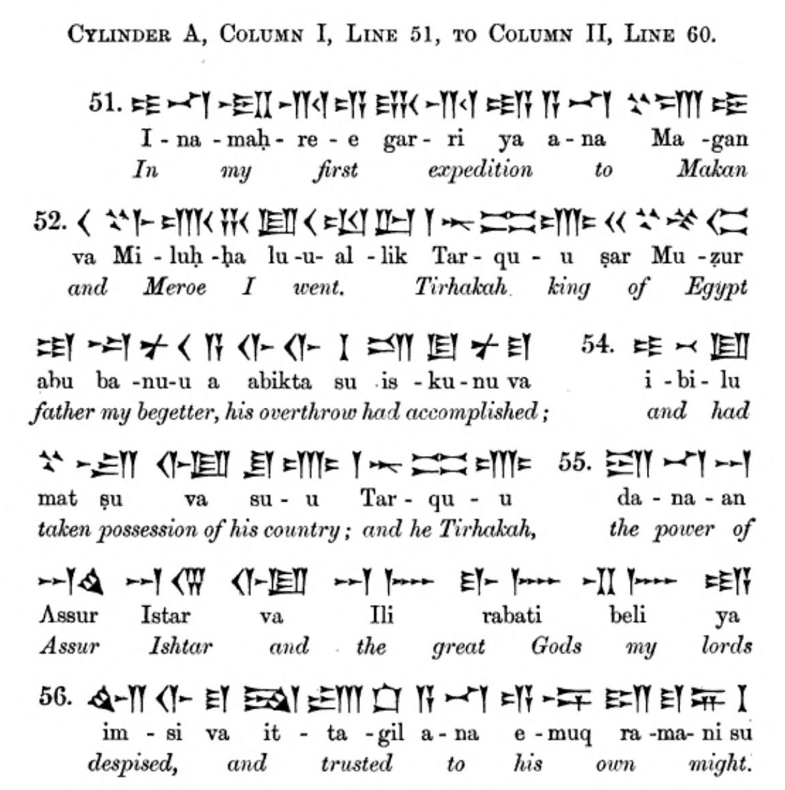
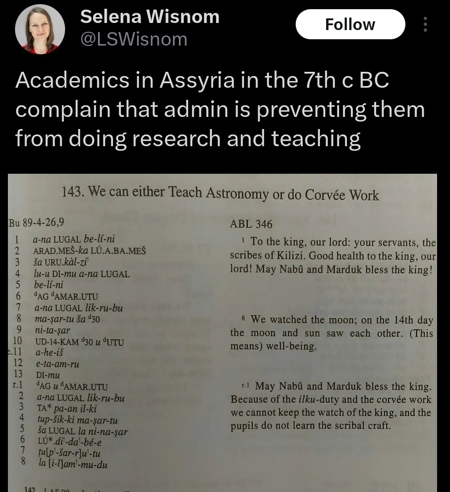
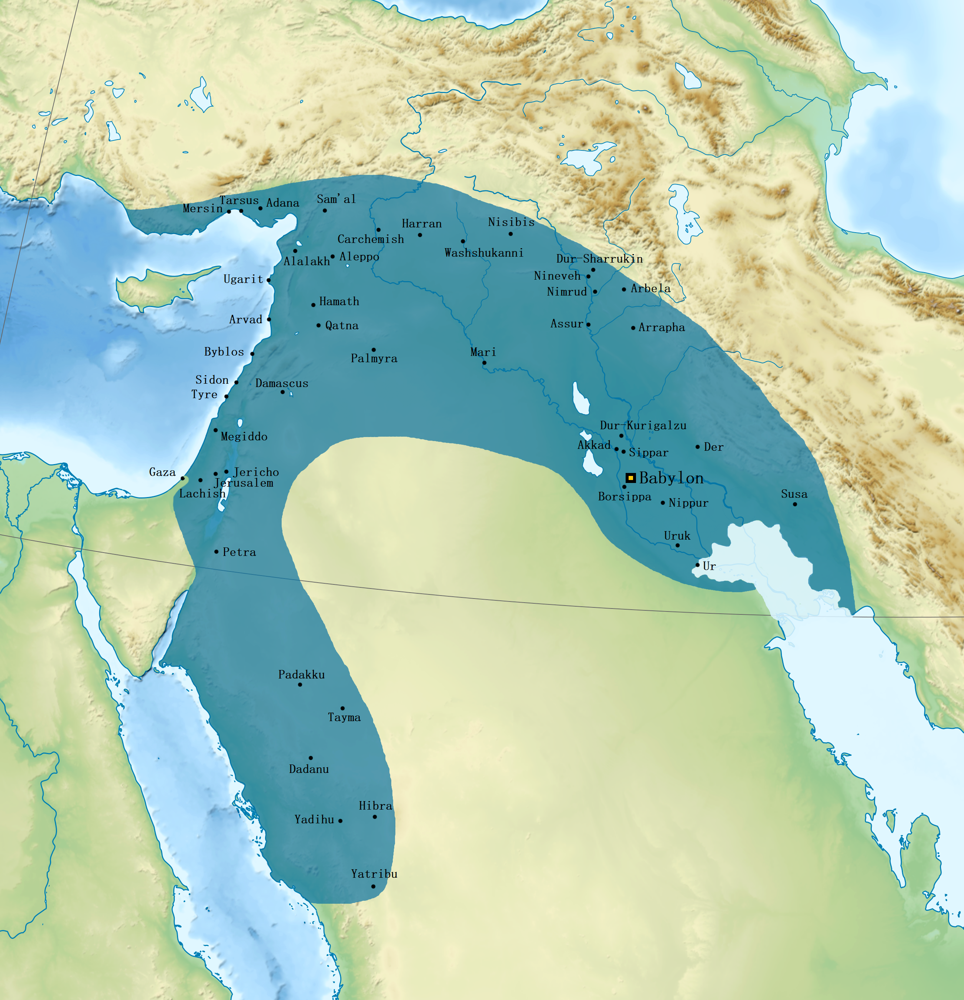
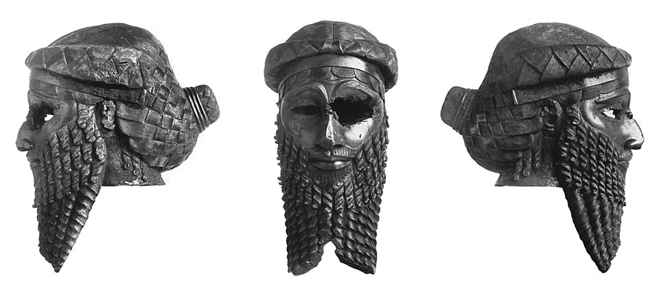
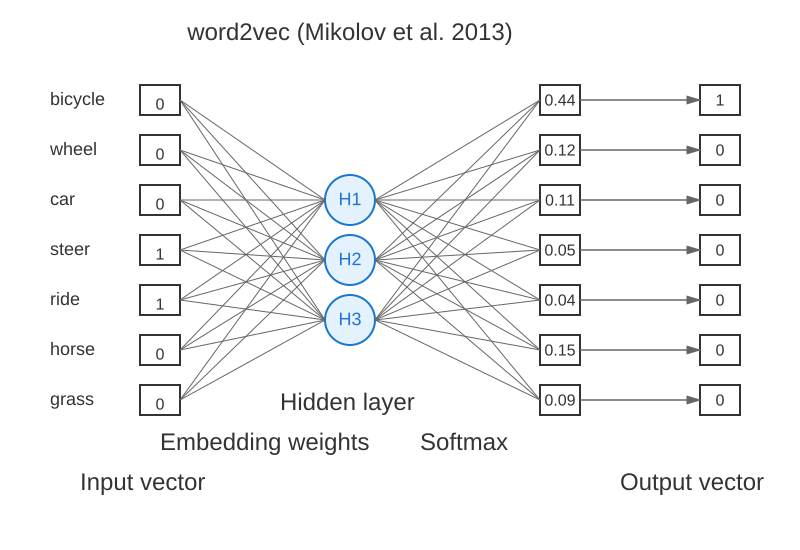
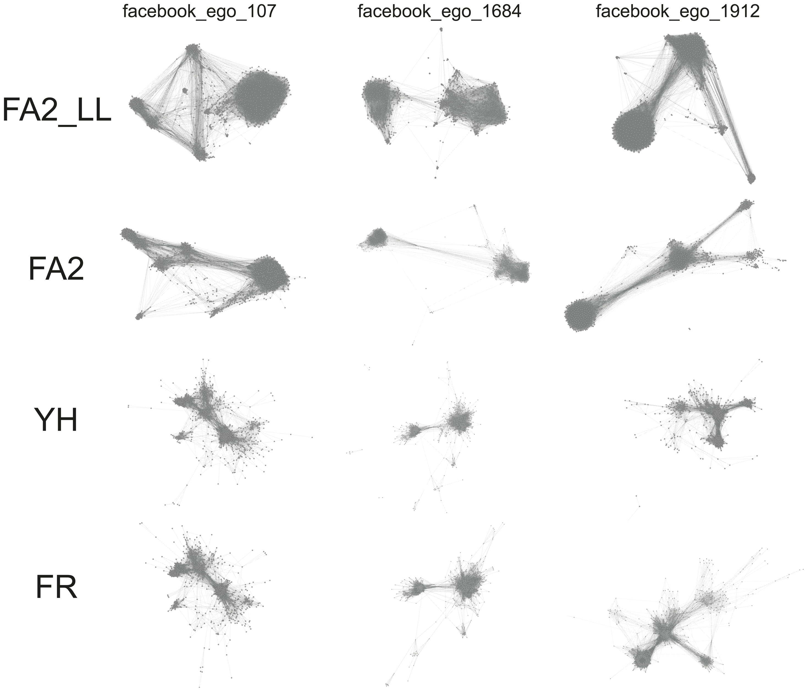
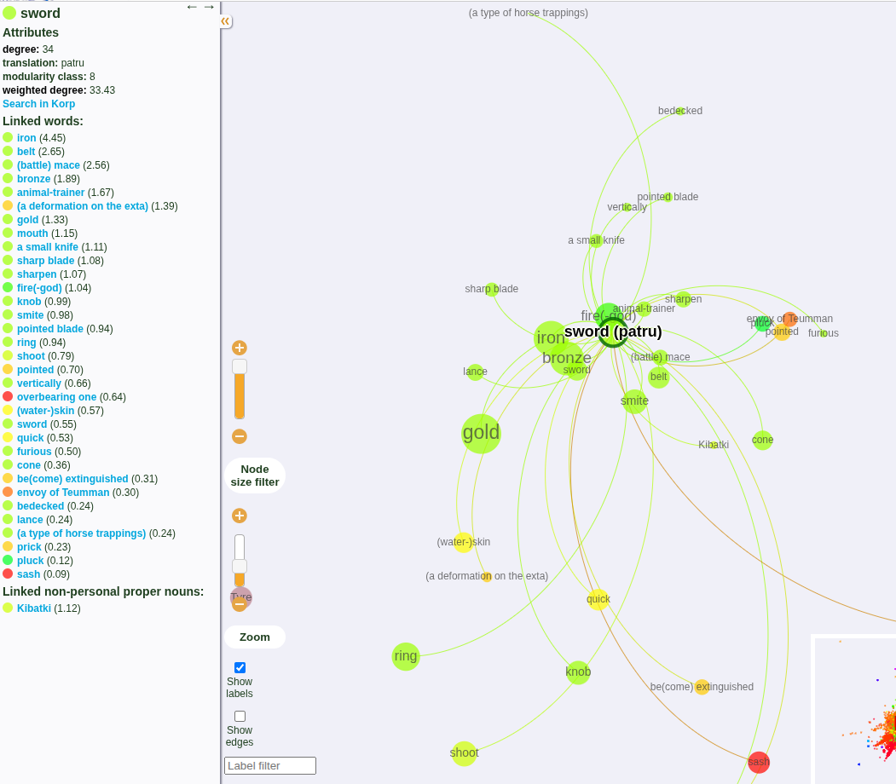
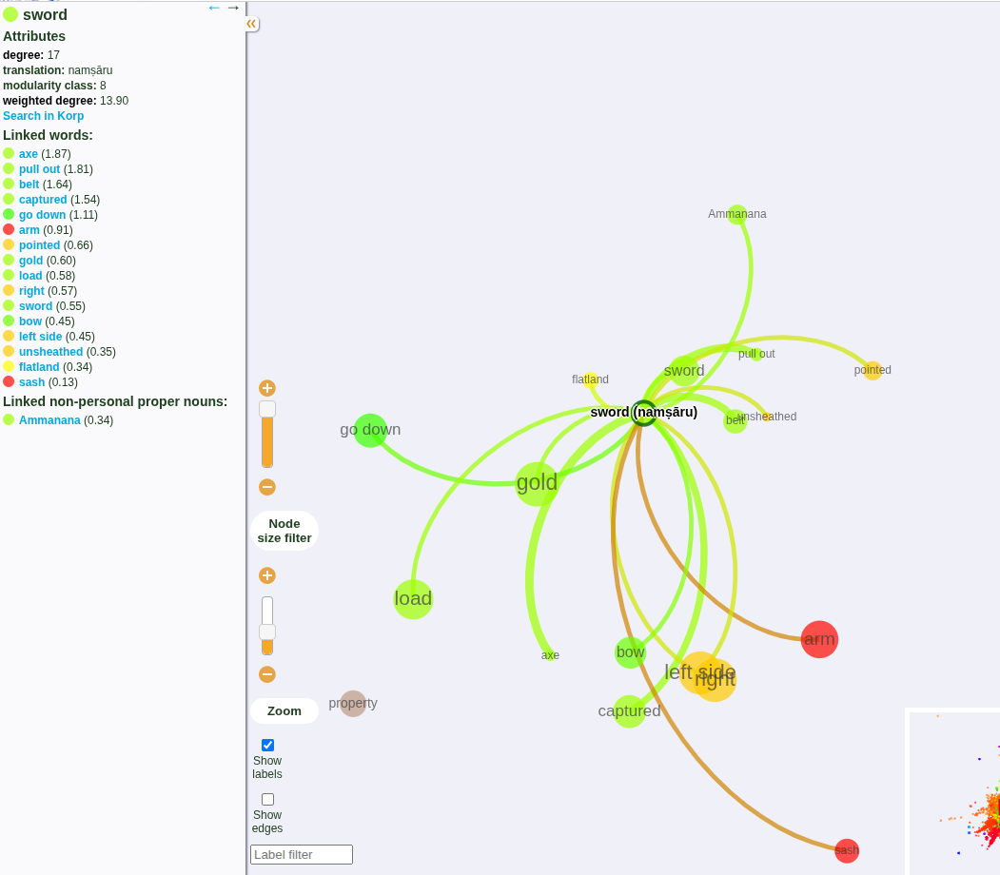
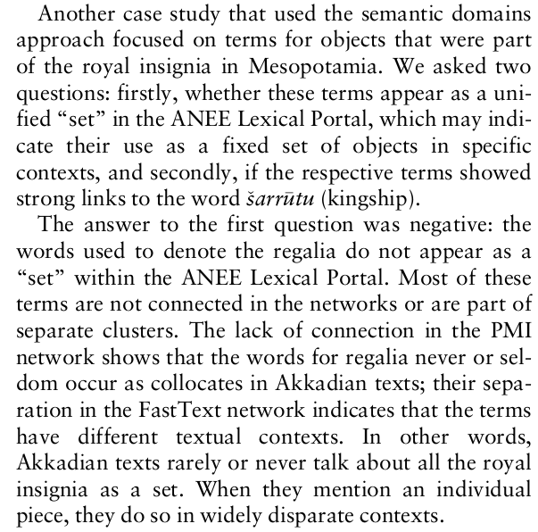
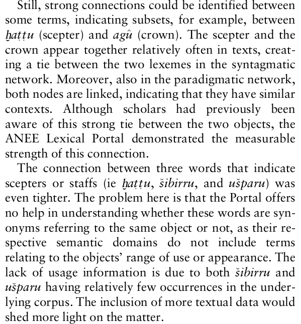

<!--  -->
<!--  -->

# Ancient languages and computational semantics {.title}

::: notes

I'm going to tell you about an interesting project I was involved in a while ago, which is a bit out of the ordinary for this seminar. It's about using computation to help with our understanding of ancient language texts.

:::

# Academy of Finland project

* ANEE: Ancient Near East Empires, Centre of Excellence 2018-2025
  * Ancient (first millennium BC) Near East (Mesopotamia)
  * Digital humanities, archeology, social sciences

::: notes

This work was a small subpart of a subpart of this project

:::

<!-- # Me -->

<!-- * _Not_ an Assyriologist, but a language technologist -->

<!-- * Contracted to do some work on this at UHEL, now developing the Language Bank at CSC -->

# Akkadian language

* In the extinct family of East Semitic languages

* In use approx. 2500 BC - 500 BC

* Had strong influence on Aramaic, which ultimately replaced it

* You may know it from: the epic of Gilgamesh

# Akkadian language

::: {.compress}

|Akkadian|Hebrew|Arabic|English|
|------|------|------|--------|
|bītum|báyit (בַּיִת)|bayt (بَيْت)|house|
|šarrum|śar (שַׂר)|sarī (سَرِيّ)|king / prince / official|
|ilum|ʾēl (אֵל)|ilāh (إلٰه) → Allāh (الله)|God|
|šulmu|šālōm (שָׁלוֹם)|salām (سلام)|peace, well-being|
:::

# Cuneiform writing

* What is preserved from Akkadian is cuneiform inscriptions, wedge-shaped impressions in clay tablets

* Logosyllabic: some words are written with a single logogram, others with syllable signs

<!-- * A borrowing from Sumerian, an earlier language in the region, which is unrelated to Akkadian but remained in ceremonial use alongside it -->

::: notes

There was most likely a lot more writing on wax tablets, papyrus etc. but that has all been lost.

:::

# Cuneiform writing

<figure>

<figcaption>Ashurbanipal's Egyptian campaign</figcaption>
</figure>

::: notes
Assur, Istar start with the same symbol as Ili, which is followed by a plural form. Also -an syllable in prev line.
:::

# Cuneiform writing

<figure>

	<figcaption>Royal scribes complain that other duties are keeping them from astronomical observations and teaching</figcaption>
</figure>

# Cuneiform writing

* A surprisingly large number of clay tablets have been preserved, ca. 500 000

* Only about 10% of them have been transliterated, translated and published

# Mesopotamia

<figure>

<figcaption>Neo-Babylonian Empire ca. 550 BC</figcaption>
</figure>

::: notes
At its height, delimited by Mediterranean, Caucasus Mountains, Caspian Sea, Red Sea, and the Syrian Desert.
:::

# Mesopotamia

* City-states of Sumer 5500 BC - 1800 BC (_Ur_)
* Akkadian empire 2300 BC - 2100 BC (_Sargon of Akkad_)

# Mesopotamia
* Assyrian and Neo-Assyrian empire 2000 BC - 600 BC (_Tukulti-Ninurta_, _Tiglath-Pileser_, _Library of Nineveh_)
  * You may know them from: The Old Testament! (2. Kings, Chronicles etc.)
* Neo-Babylonian empire 626 BC – 539 BC (_Nebuchadnezzar_)
  * Old Testament: Sack of Jerusalem, Babylonian exile

# Challenges

* The material covers long periods of history, it is plentiful, and hard to interpret (there are few experts)

* Could computational methods reveal linguistic, cultural and social phenomana?
  * Social elites formed by personal names
  * Semantic distinctions, diachronic (across time) and synchronic (at one time)

# Lexical semantics

* Distributional hypothesis: words with similar contexts have similar meanings
  * _bicycle wheels, car wheels, steering wheels, car steering, bicycle steering_
  * _riding a horse, riding a bicycle_
  * _horses eat grass_

::: notes
Obviously perfect synonyms have the same distributions. The other direction is less obvious. Some words with similar distributions (good, bad) have opposite meanings. It would be nice to be able to separate out not just the degree of difference but also the direction of difference.

Bicycle, car and steering appear with wheels, wheels, bicycle and car appear with steering

Horses and bicycles are both ridden, but only horses eat grass
:::

# Lexical semantics

|         |bicycle|wheel|car|steer|ride|horse|grass|
|---------|-------|-----|---|---- |----|-----|-----|
|bicycle  |       |  31 | 5 |   11| 39 |  2  |  3  |
|wheel    |  31   |     | 27|   8 | 12 | 0   |  1  |
|car      |  5    |  27 |   |   13| 5  | 4   |  2  |
|steer    |  11   |  8  | 13|     | 9  | 1   |  0  |
|ride     |  39   |  12 | 5 |  9  |    | 27  | 10  |
|horse    |  2    |  0  | 4 |   1 | 27 |     |  19 |
|grass    |  3    | 1   | 2 |   0 | 10 |  19 |     |

::: notes
This co-occurrence table captures all the co-occurrence information

You can already think of the rows as vectors, and compute dot products between words
:::
 
# 
 

# PMI

* Pointwise mutual information: how much more likely are A and B together than in general? $log_2$ of that: how many bits does seeing A tell you about B?

<!-- $$\operatorname{pmi}(x;y) \equiv \\ \log_2\frac{p(x,y)}{p(x)p(y)} = \log_2\frac{p(x|y)}{p(x)} = \log_2\frac{p(y|x)}{p(y)}$$ -->
$$\operatorname{pmi}(x;y) \equiv \log_2\frac{p(x,y)}{p(x)p(y)}$$

* Produces pairwise "proximities", not a vector space

# Interpreting word embeddings

* Word embeddings are usually used as inputs to ML pipelines, not directly interpreted

* They are points in a space with hundreds of dimensions

* PMI pairs form a network with $N^M$ edges, and they don't come with a natural 2D (or 3D) embedding

# Interpreting word embeddings

* Dimensionality reduction - PCA (principal component analysis), LDA (linear discriminant analysis), ...

* Problematic: big linguistic features dominate, semantic distinctions disappear

::: notes
Maybe it would be easier if we could visualise the points in 2D.
:::

# Layout algorithms

* Proximities in the embedding space or in PMI can be turned into "attractive forces" in a lower dimensional space

* A "physics simulation" ends up in a settled / minimal energy state

* Yifan Hu, Fruchterman-Reingold, ForceAtlas

* ForceAtlas2: Mathieu Jacomy et al. (2014)

# Layout algorithms

::: notes
LL = LinLog
:::

# Demo: ANEE portals

* <a href="https://www.helsinki.fi/en/researchgroups/ancient-near-eastern-empires/anee-lexical-networks-v20">Lexical portals on ANEE's site</a>

::: notes
First millennium texts, english, sword = patru / namsaru
:::

# patru vs. namṣāru

  
  

<!--    -->

# Applications

<figure>

<figcaption>Lindén et al.: Social group identities and semantic domains in the ancient Near East (2024)</figcaption>
</figure>

# Applications

<figure>

<figcaption>Lindén et al.: Social group identities and semantic domains in the ancient Near East (2024)</figcaption>
</figure>

# Links

* <a href="https://etsin.fairdata.fi/datasets?search=akkadian&page=1">Akkadian source data in the Etsin service</a>
* <a href="https://www.helsinki.fi/en/researchgroups/ancient-near-eastern-empires/anee-lexical-networks-v20">Lexical portals on the ANEE site</a>

# Image credits
::: {.compress}
Ashurbanipal's campaign: from Smith, George: _History of Assurbanipall, Translated from the Cuneiform Inscription_ (1871, <a href="https://archive.org/details/bub_gb_pFk53uejMjcC/page/n63/mode/2up">archive.org/details/bub_gb_pFk53uejMjcC/page/n63/mode/2up</a>)

Map of Neo-Babylonian empire: <a href="https://en.wikipedia.org/wiki/Neo-Babylonian_Empire#/media/File:Neo-Babylonian_Empire_under_Nabonidus_map.png">en.wikipedia.org/wiki/Neo-Babylonian_Empire#/media/File:Neo-Babylonian_Empire_under_Nabonidus_map.png</a>

Mask of Sargon: <a href="https://commons.wikimedia.org/wiki/File:Sargon_of_Akkad_(1936).jpg">commons.wikimedia.org/wiki/File:Sargon_of_Akkad_(1936).jpg</a>

Layout algorithms: <a href="https://journals.plos.org/plosone/article?id=10.1371/journal.pone.0098679">journals.plos.org/plosone/article?id=10.1371/journal.pone.0098679</a>
:::
<!--  -->
