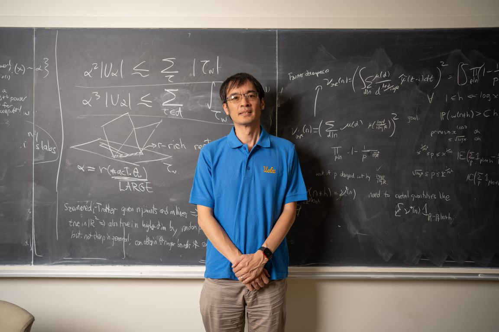
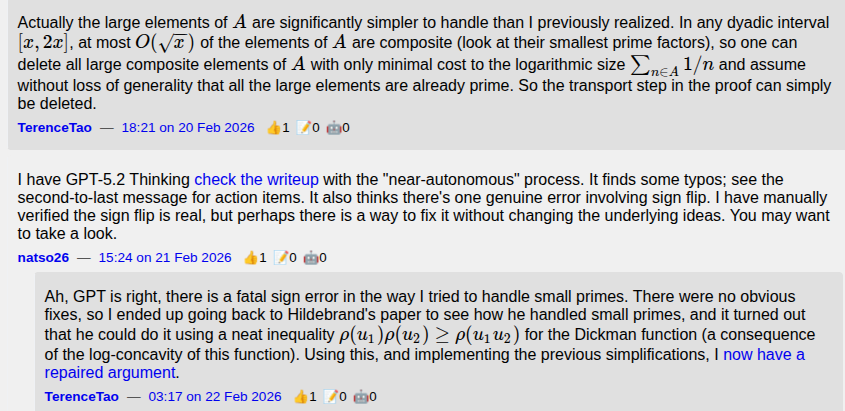
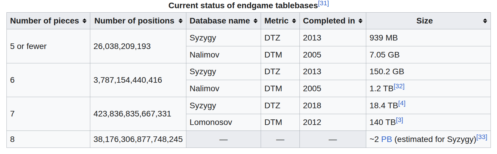
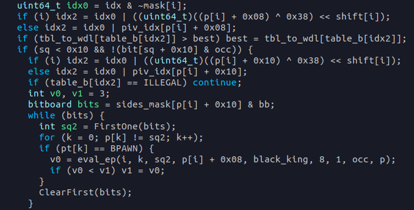
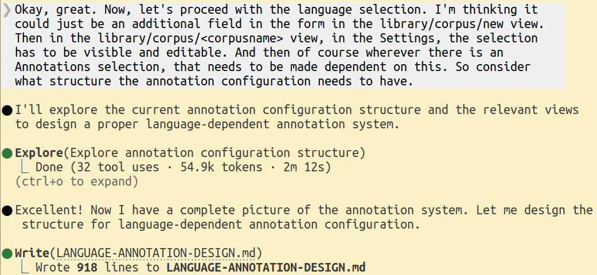
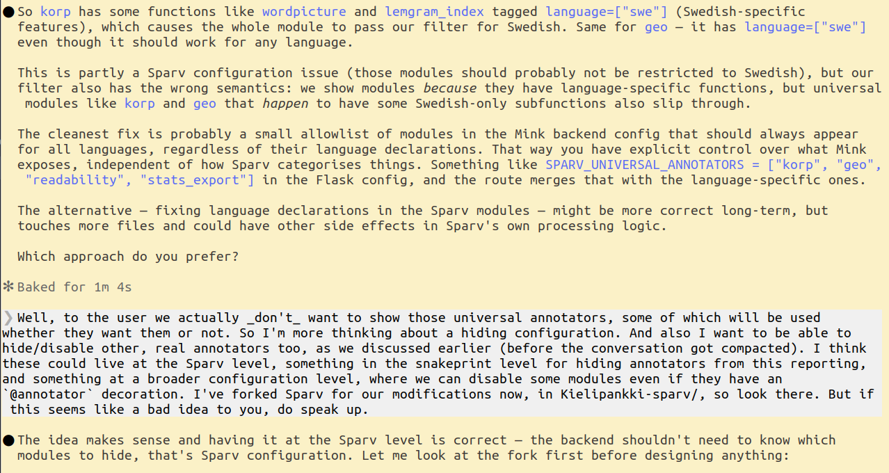
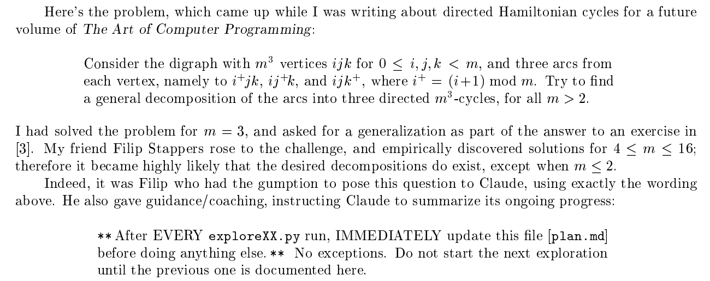
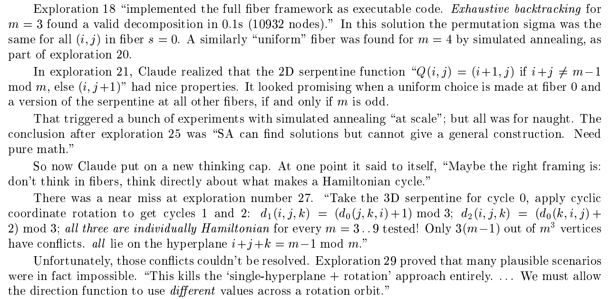

# AI Tools for Scientific Software Development

*This post is based on a talk I gave at the SCITECH staff seminar. I'm not really an AI expert, but I've been talking about these tools enough that my colleague Jussi Heikonen asked me to present. His concern: are we falling behind? My short answer is: not very far behind, because in my opinion these tools only became really good about three months ago.*

---

## Things are moving very fast

If your understanding of AI tools comes from using them more than three months ago, using the official company Copilot, or only using free services, you need to completely revise your understanding. The pace of improvement has been dramatic enough that older impressions are likely out of date.

---

## Recent dramatic examples

### Donald Knuth and Claude's Cycles

As a demonstration of what recent models can do, one of the most striking recent examples comes not from software development per se, but from actual science done with software: Claude recently made progress on a long-standing open problem that Donald Knuth had been working on, at age 88.

### Terence Tao and the Erdős Problems

A few weeks ago, someone directed ChatGPT at [erdosproblems.com](https://erdosproblems.com), a repository of open mathematical problems. The model extended Terence Tao's existing work to nearly solve one of them. Tao joined the effort — and in the resulting exchange, was corrected by ChatGPT.

---

## The state of things at the start of 2025

Going into 2025, AI chatbots were getting useful for getting started on a problem or getting unstuck. AI code completion (Copilot and similar) was gaining traction in IDEs. Hallucinations were still a significant problem — models would often propose API calls that didn't actually exist.

---

## The last six months: Claude Code

Around this time I started hearing more about AI agents, and in particular about Claude Code, which was released in February 2025. I got a paid Claude account to try it, and it was immediately useful.

What is Claude Code? It drops into your terminal, reads your codebase, writes a `CLAUDE.md` file to track context, has subagents (like a dedicated code reviewer), planning modes, branching memory, and skills. It's a fairly complete agentic coding environment.

The rest of this post focuses on Claude Code specifically, because that's what I know.

---

## Initial experiments

My first experiments were relatively mundane, but still revealing. I asked it "what am I bad at?" — in the sense of pointing it at my code to find weaknesses. I also used it heavily on modern frontend work, which I find tedious to keep up with, and on gnarly PHP embedded in WordPress installations.

The thing that struck me early: *it knows almost everything, and it can search the web.* Not just every programming language, database, library, or framework — but also linguistics, mathematics, physics, biology. The breadth is genuinely surprising.

---

## Around December: a dramatic step change

> "Like many others I rapidly went from about 80% manual + autocomplete coding and 20% agents in November, to 80% agent coding and 20% edits + touchups in December. I really am mostly programming in English now."
> — Andrej Karpathy, Dec 2025

Something changed noticeably around December. Karpathy put it well. The models crossed a threshold where delegating whole tasks — not just completions — became the default mode of working.

---

## My Christmas holiday project: chess endgame tablebases

Claude Opus 4.5 had just been released with a lot of surrounding hype. So I decided to tackle a difficult hobby project I'd been thinking about for a long time: adapting the Syzygy endgame tablebase generator for a chess variant called "stalewin" (where stalemate is a win instead of a draw).

To appreciate the scale of the problem: a 6-piece tablebase covers nearly 4 trillion positions and weighs in at 150 GB. An 8-piece tablebase is estimated at around 2 petabytes — and hasn't been built yet.

The example below shows why the variant is interesting: a king-and-pawn vs. king position that is a draw in regular chess (the defending king can just shuffle), but a white win in stalewin (white can force the black king into stalemate).

The Syzygy generator is not an easy codebase:
- 47 C files, ~40,000 lines of code
- Multithreaded
- Low-level
- Almost entirely uncommented
- "Run once, forget forever" code

My process:
1. Introduced the project to Claude Code, asked it to read the codebase and write a summary in `CLAUDE.md`
2. Asked it to identify which parts of the code needed to change
3. Described how to validate correctness (e.g., king+knight+knight vs. king should be mostly a win in stalewin, and a draw in regular chess)

On validation: it got confused at one point when some positions that should be draws in regular chess were showing as wins. I explained the discrepancy, it understood, and then it made a note in `CLAUDE.md` on its own.

### Token costs

Opus burned through the token allowance in my "Pro" subscription very quickly. I ended up working in short bursts waiting for tokens to refresh — and at one point spending €20 out of sheer momentum.

### Where it failed

After getting the tablebase generator working (about 10 days of computation on my desktop), I wanted a browsing interface. Claude developed a Python implementation that tried to load each position into a Python object. The problem: even if each position were 1 byte, you'd need petabytes of memory. Python objects are more like 1000 bytes each.

Claude didn't connect the dots between the approach it chose and the scale of the problem. The general lesson: **you have to tell it what to do precisely enough — it decides how, but often picks an approach that runs into problems later, or misunderstands the ultimate goal. You need a reasonably good idea of what you're actually trying to achieve.**

---

## More ambitious work projects

I was the only developer working on a feature that touched six or seven interconnected systems: mink-frontend, mink-backend, Sparv, Korp, provisioning code, an authorization service, and databases. This kind of cross-cutting work is normally very slow for a single developer. Claude Code, running with Sonnet (not Opus), made it tractable.

The screenshots below show parts of a single work session.

---

## A hierarchy of tool agency

It's useful to think in levels:

- **Level 1** — Copy-pasting from a chatbot window
- **Level 2** — Autocomplete in an IDE
- **Level 3** — Interacting with an agent in a feedback loop
  - *3a:* You inspect the code continuously as it works
  - *3b:* You inspect only the outcome ("vibe coding")
- **Level 4** — Agent in a harness (fully automated, running without your input)

The Knuth result mentioned above was achieved at Level 4.

---

## Implications

- A small team can now undertake big projects, or fearlessly attempt large-scale changes
- Experimenting has become much cheaper
- A really motivated individual can do *a lot*

---

## Caveats

### Security

Claude generally asks permission before taking actions, so it won't silently read everything it has access to. But if you want to be careful, run it on a VM, a separate user account, or keep sensitive data otherwise inaccessible.

One concrete example: it will automatically try to detect if you're in a git repository and connect to remote hosts, which means it will try to access your SSH keys. You can refuse when prompted, but if you allow it, you are effectively giving Anthropic access to those keys. A separate SSH key for git access is prudent in any case.

### Skill atrophy and loss of understanding

When you delegate tasks, you build less understanding of the code you're producing. This is worth thinking about deliberately.

### Context collapse and compaction

Models have a finite context window. When ingesting a large codebase and doing a lot of reasoning, it fills up. When that happens, the context gets compacted — a lot of detail is lost, and it can be hard to continue without re-introducing a lot of context. Sometimes it's better to start fresh. You can pay for larger context budgets.

Also: if you and Claude Code both edit the code simultaneously, you need to tell it what you changed, or it will start getting confused.

---

## Non-coding uses

Claude Code isn't limited to code:

- **MCP servers (Model Context Protocol)**: integrations that give it access to various external data stores
- **General data access** via the filesystem: useful for analysis and processing tasks beyond programming
- **Hooks, integrations, and workflows**: there's a growing ecosystem (including projects like OpenClaw) for extending what an agent can do

---

## Current economics

Subscriptions to the paid tiers currently feel like a great deal — because they probably are. According to reporting, a $200/month Claude Code subscription can consume around $5,000 in compute, meaning Anthropic is subsidizing heavily to build market share.

Meanwhile, Anthropic appears to be winning the professional developer market. The chart below, from Ramp Economics Lab, shows Claude's share of business AI chat spend overtaking the various ChatGPT tiers by early 2026.

---

## Becoming a power user

Andrej Karpathy again:

> "There's a new programmable layer of abstraction to master [...] agents, subagents, their prompts, contexts, memory, modes, permissions, tools, plugins, skills, hooks, MCP, LSP, slash commands, workflows, IDE integrations, and a need to build an all-encompassing mental model for strengths and pitfalls of fundamentally stochastic, fallible, unintelligible and changing entities suddenly intermingled with what used to be good old fashioned engineering."
> — Andrej Karpathy, Dec 2025

This captures the real work of using these tools well. It's not just learning a new IDE plugin — it's building a mental model of a genuinely new kind of system.

---

## Appendix: More from Knuth's paper

The three excerpts below give more of the flavour of Knuth's account of working with Claude on the directed Hamiltonian cycle decomposition problem.

