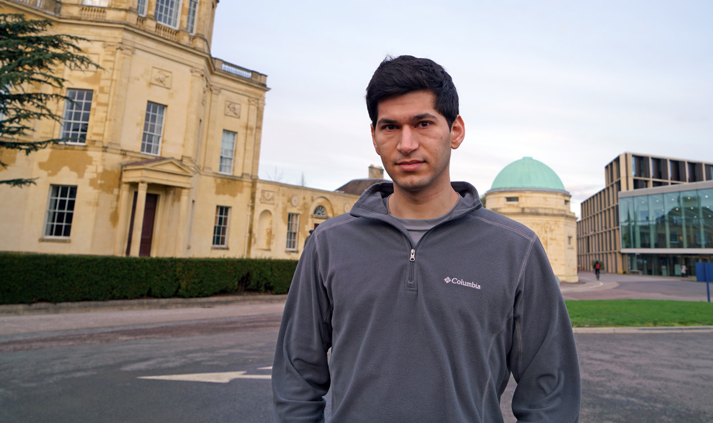
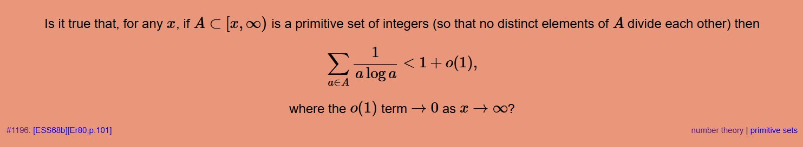
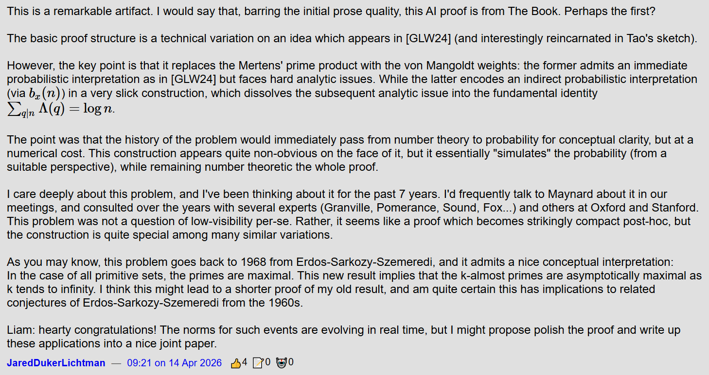
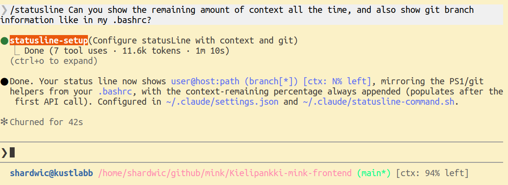
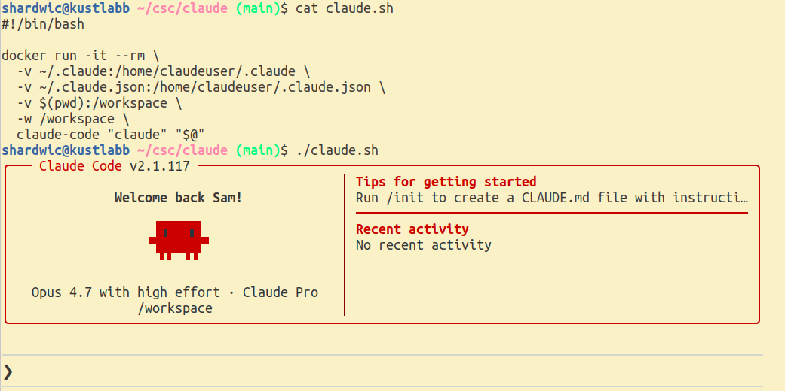

<!--  -->
<!--  -->

# Recent developments in AI tools for science and coding {.title}

::: notes

I'm not an expert in these tools, I'm just a user.

I'm going to share my personal experience in using them and describing some of the recent changes. I'm not giving a comprehensive overview, I'm going to focus on what I think are the most critical things going on right now, that I know about.

::: 

# Things are moving very fast

You need to completely revise your understanding of AI tools if it's mostly based on:

- Using AI tools 4+ months ago

- Using the official company Copilot

- Using free services

::: notes
Hands up? I'm going to try to convince you.
:::

# Donald Knuth, February

<figure>

<figcaption>Donald Knuth, age 88</figcaption>
</figure>
<figure>

<figcaption></figcaption>
</figure>

::: notes

This is not really software development, but as a demonstration of recent capabilities increase, a very recent and very extreme example of scientific software development, actually doing science with software.

:::

# Terence Tao, February

<figure>

<figcaption>Terence Tao</figcaption>
</figure>
<figure>

<figcaption></figcaption>
</figure>

::: notes

This is a screenshot from erdosproblems.com, a repository of open problems in mathematics. Someone had told ChatGPT to try to solve problems, and it extended Tao's work to almost solve one of them. Tao came to help with the work, and here we see Tao being corrected by ChatGPT.

:::

# Jared Lichtman, April

<figure>

<figcaption>Jared Lichtman</figcaption>
</figure>
<figure>

<!-- <figure> -->
<!--  -->
<!-- <figcaption></figcaption> -->
<!-- </figure> -->
<!-- <figure> -->

<figcaption></figcaption>
</figure>

::: notes

This is perhaps a bit more impressive, since this problem was solved more or less solo by AI, and the problem was somewhat more important to mathematicians than the previous ones. The solution also appears to have made genuinely new connections between areas of mathematics. Liam here is Liam Price, who was able to produce the proof with ChatGPT 5.4 Pro.

:::

# At the start of 2025

- AI chatbots were getting useful in getting started and getting unstuck

- AI assistants (code completion) were gaining traction

- Hallucinations were still quite a big problem

::: notes

Okay, back to something more like software development.

Hallucinations: they often proposed to use an API call that didn't really exist.

:::

# The last six months

- I started hearing more about AI agents, especially Claude Code (released Feb 2025)

- I got a paid Claude account five months ago to try it

- It was immediately useful

::: notes

The paid account comes with a certain amount of usage, which resets periodically.

What is Claude Code? Drops in terminal, reads all your code you give it access to, writes CLAUDE.md, has subagents ("code reviewer"), modes ("planning"), branching memory, skills ("simplify")

Basically the rest of the talk I will be talking about Claude Code, because that's what I know.

:::

# Initial Claude Code experiments

::: incremental

- "What am I bad at?"

- Modern frontend stuff

- Gnarly PHP embedded in eg. Wordpress

- "It knows almost everything, and it can google"

:::

::: notes

Okay, this is relatively mundane, but still really useful

By everything I don't mean just every programming language, databases, libraries, frameworks... but also linguistics, mathematics, physics, biology, etc.

:::

# The last three months

Around December, there was a dramatic improvement.

> "Like many others I rapidly went from about 80% manual + autocomplete coding and 20% agents in November, to 80% agent coding and 20% edits + touchups in December. I really am mostly programming in English now" 
> - Andrej Karpathy, Dec 2025

::: notes

What exactly changed then? It's not 100% clear, but probably one major thing was the release of Claude Opus 4.5 on November 24th 2025. Though I found Sonnet 4.5 (September 29th) to be dramatically useful too. I think part of it is advances in Claude Code, the software that is often used to do programming with Claude models. And perhaps also an increase in awareness of the model abilities.

(Of course, though we know model release dates, we don't really know what's going on behind the scenes. Most people seem to believe that the models sometimes get randomly better or worse due to compute constraints.)

:::

# My Christmas holiday project: chess endgame tablebases

<figure style="margin: 0;">
<figcaption></figcaption>
</figure>

<figure style="margin: 0;">
<figcaption>Drawn in regular chess, white wins in stalewin</figcaption>
</figure>

::: notes

Claude Opus 4.5 had recently been released, and I was hearing tons of hype about it. So I decided to look at a difficult hobby project I had been thinking about for a long time.

In computer chess, there are "endgame tablebases", precalculated compressed databases of all possible combinations of a small number of pieces telling you the result with perfect play, and the result of each possible move (win/draw/loss).

One thing that is sometimes debated in chess is stalemate, where one side has no legal moves left. In regular chess, stalemate is a draw, but arguably it would make more sense if stalemating your opponent would be a win. Many important endgames are drawn only because of stalemate, so we know it would change endgames a lot. But as far as I know this hasn't really been quantified, so I wanted to change the code that calculates these tablebases to consider stalemate to be a win, and then recalculate  the tables.

:::

# My Christmas holiday: adapting the Syzygy generator

:::::: columns
::: {.column width="40%"}

- "Run once, forget forever"
- 47 C files, 40K lines of code
- Multithreaded
- Low-level
- Uncommented
:::
::: {.column width="60%"}

<figcaption></figcaption>
</figure>
:::
::::::

::: notes
Remind you of any scientific code you may have seen? The code exists to produce a final output, there are no "normal users". And it's not just one place in the code you have to change, *and* it's hard to know when you've found every relevant place.
:::

# My Christmas holiday - process

- Introduce project to Claude Code, instruct it to read the codebase and write a summary in CLAUDE.md

- Ask it to identify the locations in the code we need to modify

- Instruct about how to validate

::: notes
Validate: eg. we want KNNvK to be mostly a win in stalewin and draw in regular. It got confused when sometimes it was win in regular. I explained, it understood, and then it made a note!
:::

# My Christmas holiday - Opus

- Opus burned through the tokens in my "Pro" level account very fast

- I had to either work in short bursts and wait for tokens to refresh, or pay for more token budget

- I ended up spending 20 euros out of momentum

# My Christmas holiday - Claude fails

- I wanted a browsing interface to the tablebases

- Claude developed a Python implementation that tries to load each position into a Python object

- It would have needed many terabytes of memory even if each position were 1 byte, but it's Python, they're more like 1000 bytes

::: notes

After calculating the 6-man stalewin tables (~10 days on my desktop). Claude was naive here and didn't connect the dots.

Generally: you have to tell it what to do, exactly enough. It can decide how to do it. But often it will choose a way that will run into problems later, or based on a misunderstanding of the ultimate goal. You have to have a pretty good idea of what you are doing.

:::

# More ambitious work projects

- Replacing a single-customer on-server Python authorization service with a from-scratch Node.js server with multiple customers

- Writing ambitious new features for a service that touches 5 codebases

::: notes
Almost all code for the authorization service written by Claude, with close supervision and team review. The ambitious new features thing will be in the next slides.
:::

# More ambitious work project

<figcaption></figcaption>
</figure>

::: notes
I know these are the worst slides ever... But I can't think of another way to show how this works.

Here I'm developing a feature that involves not just mink-frontend and mink-backend, but sparv, korp, our provisioning code, our authorization service, databases...

and I'm the only one one our team developing this. This kind of thing can be really slow to develop.

By the way, this is all open source. And this is with Claude Sonnet, not Opus.
:::

# More ambitious work project

<figcaption></figcaption>
</figure>

::: notes
After we're generated an overview of the project, we make more notes about the specific feature.
:::

# More ambitious work project

<figcaption></figcaption>
</figure>

::: notes
Here I've said "no" to an edit, since I wasn't understanding what useMinkBackend was.
:::

# More ambitious work project

<figcaption></figcaption>
</figure>

::: notes
Claude explains patiently.
:::

# More ambitious work project

<figcaption></figcaption>
</figure>

::: notes
Our frontend isn't rendering correctly, because it's expecting something different from the backend than is actually coming through. Claude wants to add debugging prints, I say no, let's check the endpoint directly.
:::

# More ambitious work project

<figcaption></figcaption>
</figure>

::: notes
Problem identified and fixed.
:::

# More ambitious work project

<figcaption></figcaption>
</figure>

::: notes
Here Claude has gotten the wrong idea. It thinks I'm trying to make sure a certain class of annotators is always visible, when I wanted to make sure the changes we were making would not cause them to become visible. So I explain that I want a hiding configuration and also a disabling configuration, at different levels of the backend logic.
:::

# Hierarchy of tool agency

- Level 1: Pasting from chatbot window

- Level 2: Autocomplete in IDE

- Level 3: Interacting with agent in a feedback loop
  - 3a: You inspect the code continuously
  - 3b: You just inspect the outcome ("vibe coding")

- Level 4: Agent in a harness

::: notes
How I personally am thinking about how much initiative a tool is taking.

Agent in a harness: the agent loops autonomously on a broad goal, and also collects messages and information from its environment continuously. A simple harness is actually how the Knuth thing from slide 2 got done!
:::

# Implications

- A small team can now undertake big projects, or fearlessly try big changes

- Experimenting is much cheaper

- A really motivated individual can do _a lot_

::: notes
I'm old and tired with 3 kids, so I don't actually have the energy to do that much with it, but it still makes me way more effective. If things were different...
:::

# Caveats

- Security

- Skill atrophy / loss of understanding

- Context collapse / compaction

::: notes
Claude generally asks for permission to do things, so it doesn't automatically just read everything it has access to. But if you want to be very safe, run it on a VM, separate user account, or keep sensitive data otherwise inaccessible.

It will for example automatically try to see if it's in a github repository and connect to remote hosts, so it will try to unlock your ssh keys for that. You can refuse, but if you let it do so, consider having a separate ssh key for git access (separate keys can be prudent anyway). With naive use you _are_ giving access to your SSH keys to Anthropic.

Using these tools does start to degrade your skills, and as a team you have to review a lot of code, and even then it can easily happen that you don't understand your own codebase anymore.

The models have a certain amount of context, and when that runs out (easy when it's ingesting a lot code and doing a lot of reasoning), the context gets compacted. At that point, a lot is lost, and it's sometimes difficult moving forward without reintroducing a lot of context, might be better off just starting fresh. You can pay for more context though.

By the way, in the models with more context, like 1M tokens in Opus, reasoning / recall seems to start degrade already when the context is 30-40% full.

Coding together is possible, but if you and CC both edit code, you have to tell it what you did. Otherwise it will start getting confused.
:::

# Non-coding uses

- Integration with MCP servers (Model Context Protocol), giving it access to various data stores

- General data access using the file system

- Hooks, integrations (GitHub, messaging services, Excel, Powerpoint), ... (OpenClaw)

::: notes
(I sometimes get it to read books for me)
:::

# Current economics

<figcaption>Subscriptions currently feel like a great deal, because they are! (Forbes)</figcaption>
</figure>

# Being a power user

"There's a new programmable layer of abstraction to master [...] agents, subagents, their prompts, contexts, memory, modes, permissions, tools, plugins, skills, hooks, MCP, LSP, slash commands, workflows, IDE integrations, and a need to build an all-encompassing mental model for strengths and pitfalls of fundamentally stochastic, fallible, unintelligible and changing entities suddenly intermingled with what used to be good old fashioned engineering." 
- Andrej Karpathy, Dec 2025

::: notes

My take: it is a whole new way of thinking and working, but I actually don't think you need to become so much of an expert in these things. It's very much like working with a human, you have to see things from its point of view and help it help you.

:::

# The tools are also implemented in themselves

<figure>

<figcaption>The "slash command" /statusline is told in natural language what to do</figcaption>
</figure>

::: notes

More and more, these tools themselves are being implemented in themselves. For example, in Claude Code, there's a command /statusline to edit the status line, and the way you use it you just tell it what you want there.

:::

# Sneak peek: these tools at CSC

- I paid out of pocket at first, now I've made my first expense claim

- There is an project underway to take Claude Code into use officially

- Expected completion in June, compliance & risk assessment ongoing

# Sneak peek: these tools at CSC

- "Per seat" team plan licenses for coders, expensed to cost objects

- Recommendation to run inside a container or VM

# Sneak peek: these tools at CSC

<figure>

<figcaption>Proposed container setup</figcaption>
</figure>

# Bonus slides: how the Knuth problem was solved

<figure>

<figcaption></figcaption>
</figure>

# Bonus slides: how the Knuth problem was solved

<figure>

<figcaption></figcaption>
</figure>

# Bonus slides: how the Knuth problem was solved

<figure>

<figcaption></figcaption>
</figure>

# Image credits
::: {.compress}
Don Knuth: Richard Morris / https://www.red-gate.com/simple-talk/opinion/geek-of-the-week/donald-knuth-geek-of-the-week/

Terence Tao: David Esquivel/UCLA / https://newsroom.ucla.edu/stories/terence-tao-science-stability-future-of-math-washington-post

Forbes article: https://www.forbes.com/sites/annatong/2026/03/05/cursor-goes-to-war-for-ai-coding-dominance/

:::
<!--  -->
