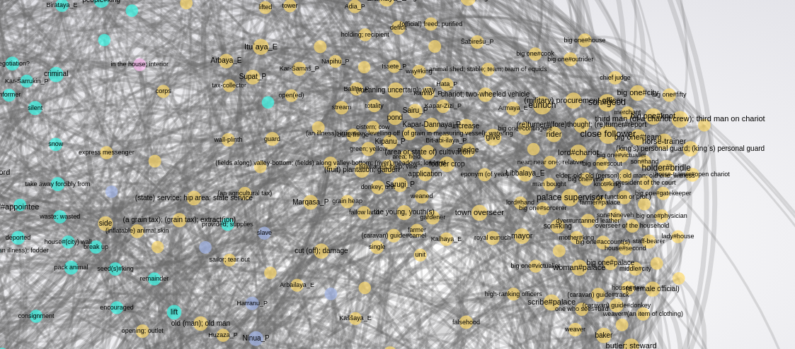

# User guide to ANEE lexical portal of Akkadian

## The main view

The main view of the lexical portal is a a big blur of colored dots. Each dot represents a word, and words are connected with each other via *arcs*. Arcs can vary in strength, and they are what cause some words to appear close together.

### Selected and highlighted words

If you zoom into the view, you will see distinct words with text hovering over the dots. Hovering on a word causes it to be highlighted, making it and its linked words stand out. Clicking on a word causes it to become *selected*; it becomes highlighted, and words that are not connected to it are hidden. A sidebar with additional information and links will also appear. If you click on an empty part of the graph, the word is deselected, and you see all the words again.

The highlighted word has its translation in parentheses; in this Akkadian-English version, it's the English translation.

### Hide edges

When all words are active and you're in a populated part of the graph, it can look very cluttered and render slowly. You can hide the edges by toggling the "hide edges" button, as shown here:

<video width="900" controls>
  <source src="hide_edges.mp4" type="video/mp4">
</video>

### Clusters

When a group of words cluster together, a program assigns a color to them. This color has absolutely no predetermined linguistic significance, although in many cases clusters are suggestive of shared typical usage. For example, in the current (as of December 2021) rendering, yellow dots to the right of the graph have many nouns related to activity, occupation and social position (*mayor*, *rider*, *brewer*, *lady#house*), some proper nouns, and some verbs. Other cluster may have predominately proper nouns, or predominately verbs.

### Filtering on clusters

If you'd like to get a view of just one cluster (in this case, indicated by colour), you can do that selecting a word in that cluster (whereupon only words connected to that word, but from any cluster, remain), then deselecting it by clicking on an empty spot, and finally clicking on "Toggle filter on this colour" in the sidepanel.

<video width="900" controls>
  <source src="filter.mp4" type="video/mp4">
</video>

## Searching

While the graph may be zoomed in using either the mouse wheel or the slider on the bottom left of the page, the main way to navigate is via the autocompleting search bar at the top. The autocompletion generates a pop-up menu, with two listings: those words ("Nodes") which contain the search term as a substring, and those words whose *translations* contain the search term as a substring. Thus, if you are browsing the Akkadian-English portal, and type *horse*, you will find Akkadian words whose translations contain "horse", such as *sisû* and *tarbaṣu* under the *Translations* heading. The autocomplete normalises to the Latin alphabet as used in English, so you can write "tarbasu" and find find *tarbaṣu* that way.

<video width="900" controls>
  <source src="search.mp4" type="video/mp4">
</video>

## The sidebar

The sidebar shows information for the most recently active word, or if a word hasn't been activated yet, it's hidden. You can also hide or show it by clicking on the orange arrows poking out from it.

### Attributes

Some details about the active word is listed under "Attributes". Some items are related to the mathematical properties of the graph:

1. Degree: how many words this word is linked to.
2. Weighted degree: The sum of the weights (or strengths) of the links between this word and other words. For example, if the word in question is linked to one word with an arc of weight 6, and another with weight 7, it has degree **2** and weighted degree **13**.
3. Community number, or modularity class: which cluster, indicated by colors in the main view, this word was assigned to.

Also listed under this heading is the translation of the word, if available, and two links.

#### Concordances

Each word is linked to a corpus search on The Language Bank of Finland's Korp search engine. Click on "Search in Korp", and a concordance view for the word will appear (allow some time for the search to be completed). This search view contains a great deal of additional information about the matching texts.

#### Ego graphs

When a word is active, its linked words may be all over the main graph, making it hard to get an overview. A condensed view may be accessed by clicking on "Go to this word's ego graph". This will cause the browser to navigate to a new page, so you will have to click the browser's back button to return to the previous view.

### Linked words

Under the headings "Linked words" and "Linked proper nouns" you will find anchor links. Clicking these activates a new word and centers the view on that word.

### Browsing history

As you navigate along the linked words (or otherwise), you may want to get back to where you were before. This can be done using the forward and backward arrows at the top of the side panel. If there is browseable history in either direction, the arrow is blue, otherwise it is black.

<video width="900" controls>
  <source src="browsing.mp4" type="video/mp4">
</video>

## The header

Along the header, there are three useful navigation links: "Main page", which takes you to the ANEE website describing the lexical portal, with references to publications; "Main graph", which takes you back to the main graph from whatever subsection you are in, like an ego graph, and "Download".

### Downloading the data

Each graph view, including the ego graphs, has a link in the header with the text "Download". The link goes to a `.gexf` file with the data you are currently viewing.

## About the data pipeline

Lexical data flows roughly as follows:

1. Corpus selection and preprocessing
2. A computational process (such as PMI or FastText) calculates relationships between words from the corpora
  * See [pmi-embeddings](https://github.com/asahala/pmi-embeddings) by ANEE team member Aleksi Sahala
3. A graph processing algorithm (currently ForceAtlas2) calculates a visual layout for the words and another graph processing algorithm assigns words to "communities" (shown by color); node degrees etc. are calculated
  * See [gephi](https://gephi.org/), [scikit-network](https://github.com/sknetwork-team/scikit-network)
4. Supplemental information, such as concordance links and translations are inserted into the graph files
  * See [our own scripts](https://github.com/Traubert/nlp-tools/tree/master/gexf)
5. Ego graphs are calculated
  * `scikit-network` and our own scripts
6. Our fork of `gexf-js`, with various custom features, is used to display the results.
  * available [here](https://github.com/Traubert/anee-lexical-portal) but not really supported for outside use
