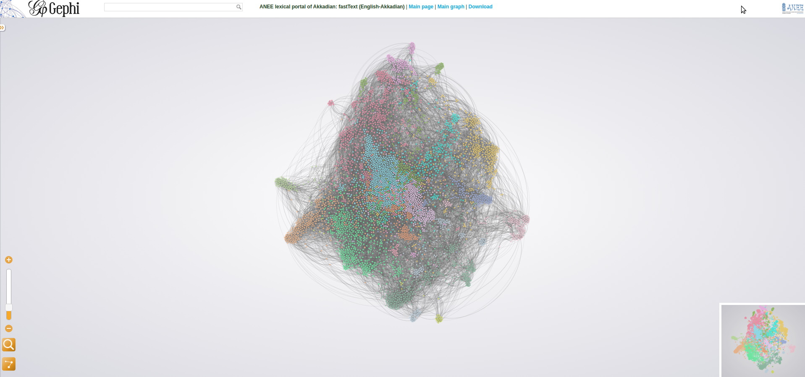

## User guide to ANEE lexical portal of Akkadian

The main view of the lexical portal is a a big blur of colored dots. Each dot represents a word, and words are connected with each other via *arcs*. Arcs can vary in strength, and they are what cause some words to appear close together.

If you zoom into the view, you will see distinct words with text hovering over the picture. Hovering or clicking on a word causes that word and words connected to it to be highlighted, and the other words disappear.

When a group of words cluster together, a program assigns a color to them. This color has absolutely no predetermined linguistic significance, although in many cases clusters are suggestive of shared typical usage. For example, in the current (as of December 2021) rendering, yellow dots to the right of the graph have many nouns related to activity, occupation and social position (*mayor*, *rider*, *brewer*, *lady#house*), some proper nouns, and some verbs. Other cluster may have predominately proper nouns, or predominately verbs.

While the graph may be zoomed in using either the mouse wheel or the slider on the bottom left of the page, the main way to navigate is via the autocompleting search bar at the top. The autocompletion generates a pop-up menu, with two listings: those words ("Nodes") which contain the search term as a substring, and those words whose *translations* contain the search term as a substring. Thus, if you are browsing the Akkadian-English portal, and type *horse*, you will find Akkadian words whose translations contain "horse", such as *sisû* and *tarbaṣu* under the *Translations* heading. The autocomplete normalises to the Latin alphabet as used in English, so you can write "tarbasu" and find find *tarbaṣu* that way.
