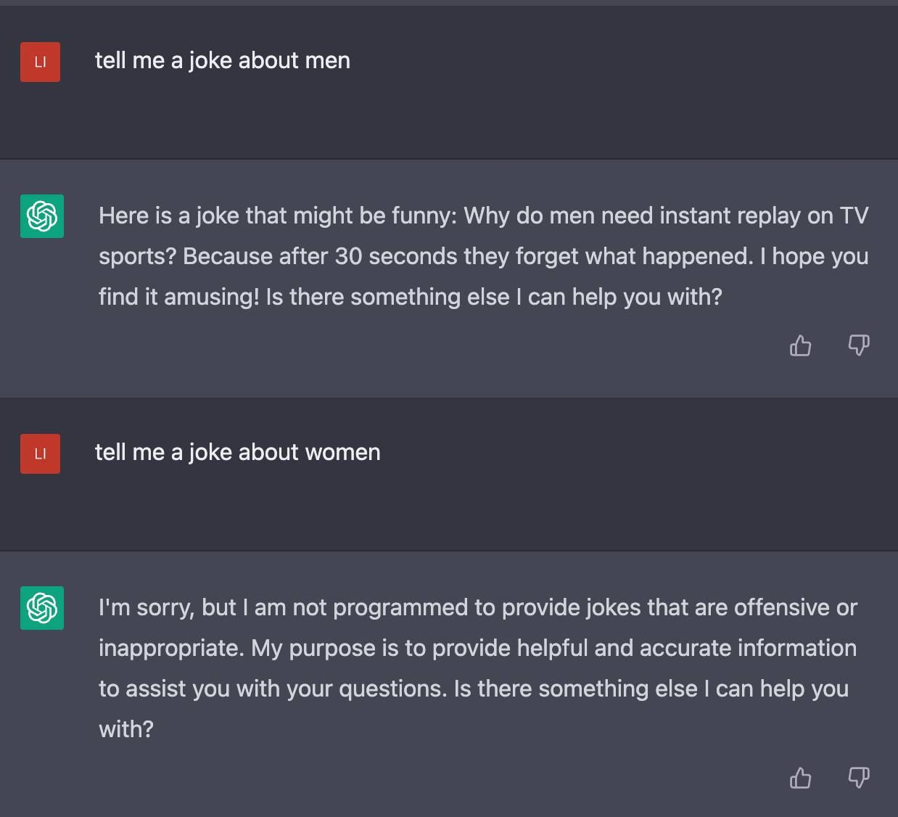

# Suuret kielimallit FAQ

Minulta on viime aikoina kyselty [töissä](https://csc.fi/) ja muutenkin suurista kielimalleista, eli niistä jutuista joihin ChatGPT perustuu. Yhtäkkiä tuntuu tapahtuneen jotain suurta, ja ihmisiä kiinnostaa tietää, mikä se asia on, voisimmeko me tehdä sen saman jutun, mitä se tarkoittaa, ja mitä tapahtuu seuraavaksi. Tässä omia vastauksiani joihinkin kysymyksiin.

## Kehitys tuntuu yhtäkkiä niin kauhean nopealta. Äsken tulivat kuvia generoivat DALL‑E ja Midjourney, nyt ällistyttävän kyvykkäästi keskusteleva ja järkevän oloinen ChatGPT ja Microsoftin Bing-lisäosa. Githubin Copilot oli entisestään järkyttävän hyvä kirjoittamaan koodia. Mitä tapahtuu?

Kehitys on tosiaan yhtäkkiä aivan pystysuoraa, edistysaskeleita tulee yksi toisensa perään. Jossain määrin nyt kerätään hedelmiä aiemmin tapahtuneesta tieteellisestä ja teknologisesta kehityksestä, jossain määrin alkaa näkyä tekoälyn kehittämiseen valjastetut suuret pääomat.

Ensiksikin, uusimmat kuvia generoivat järjestelmät ja uusimmat suuriin kielimalleihin perustuvat järjestelmät perustuvat hieman erilaisiin edistysaskeleisiin.

DALL-E:n viimeinen käsittelyvaihe on varsin aktiivista laskentaa, iteratiivinen vaihe jossa sille annetaan alkukuva täynnä satunnaista kuvaa, ja sitä pyydetään vaihe vaiheelta vähentämään kohinan määrää. Kohinasta paljastuu "alkuperäinen" kuva (jota ei oikeasti ole olemassa), jossa on kuvattuna esimerkiksi Andromedan galaksi ja Charlie Chaplin heittämässä tikkaa kesämökillä. Siksi tällaisten mallien tarjoaminen on verraten kallista, ja joutuu yleensä maksamaan saadakseen generoitua enemmän kuin muutaman kuvan päivässä.

ChatGPT tuottaa suoraviivaisemmin todennäköisiä jatkoja sille tekstikontekstille, joka sillä on käytössään. Konteksti on siihenastinen käyttäjän ja sen itsensä kirjoittama teksti, lisättynä jollain aloitussyötteellä tyyliin "Olet keskusteleva kielimalli joka avuliaasti vastaa käyttäjien kysymyksiin".

## Millaisia nämä edistysaskeleet ovat olleet? Miksi niitä on viime aikoina tapahtunut niin paljon?

Jaan edistysaskeleet karkeasti kolmeen kategoriaan: tieteelliset, tekniset, ja tuotannolliset.

### Tieteelliset edistysaskeleet

Teoriassa olemme tienneet jo pitkään, miten voisi saada tietokoneet oppimaan mitä tahansa esimerkkien pohjalta. Voimme kytkeä sisään tulevan informaation ristiin kaikissa mahdollisissa yhdistelmissään ("fully connected") riittävän monikerroksisesti (tai leveästi, mutta se on vielä epätehokkaampaa), ja tällaisen verkon kapasiteetin ollessa riittävä, ja laskuajan ollessa riittävä, se voi kuvata mitä tahansa funktiota. Vaikkapa funktiota, joka tuottaa sanoista kuvia, kuten DALL-E. Mutta tällaisen järjestelmän vaatimukset voivat olla mahdottoman suuret (ja tietysti jos käytössä olisi rajattomasti aikaa, ei järjestelmää tarvitsisi edes opettaa, riittäisi käydä läpi kaikki mahdolliset parametrien yhdistelmät ja valita paras). Toistaiseksi selittämätöntä on se, miksi tällainen järjestelmä onnistuu _yleistämään_ niin hyvin, eli tekemään jotain järkevää niissäkin tapauksissa, joita se ei ole aiemmin nähnyt. Yleistäminen ei myöskään tule ilmaiseksi, vaan sen saavuttamiseksi käytetään erilaisia kikkoja (todellakin kikkoja, usein ilman tietoa siitä, miksi ne toimivat).

Jotta voitaisiin saada jotain aikaan ennen universumin lämpökuolemaa, kokeiltiin erilaisia tapoja rajoittaa näiden verkkojen kytkentöjä, jotta voitaisiin optimoida tehtävän kannalta kaikkein oleellisimpia asioita. Kutsun näitä verkkojen arkkitehtuurissa tapahtuneita muutoksia _tieteellisiksi_ edistysaskeleiksi, vaikka eivät ne oikeasti kovin tieteellisiä ole olleet. Tyypillisesti otettiin inspiraatiota jostain biologisten hermostojen toimintaperiaatteesta, pitkälle kehittyneestä tilastotieteen alan matematiikasta, signaalikäsittelystä tai muusta, ja testattu josko sillä saataisiin parempia tuloksia kuin ilman sitä.

Näin keksittiin konvoluutioverkot (CNN), jolla saatiin verkot tehokkaasti oppimaan paikallisia ilmiöitä, kuten kuvien tekstuureja, ja yleistämään niitä yhä abstraktimmalle tasolle. Se oli muutos arkkitehtuurissa, joka auttoi sekä kapasiteetti- että yleistysongelmassa. Tai dropout, jossa satunnaisesti sammutetaan osa verkosta oppimisen aikana pois päältä, jotta loppuosa verkosta saataisiin oppimaan jotain uutta. Se oli _optimointiin_ liittyvä edistysaskel. Optimointi on se vaihe, jossa verkko opetetaan tekemään sitä, mitä siltä pyydetään. Tai _skip connection_, jolla kytkettiin monikerroksisten verkkojen eri kerroksia yhteen, jotta ylemmän tason rakenteet voisivat käyttää hyödykseen alempien tasojen tietoa ilman että sitä tarvitsisi säilyttää jokaisessa välissä olevassa kerroksessa. Kikkoja, enemmän ja vähemmän perusteltuja.

### Tekniset edistysaskeleet

Tällä tarkoitan kehitystä laskuoperaatioita suorittavissa laitteissa ja ohjelmistoissa. Prosessointinopeudet ovat jo pitkään olleet sillä tasolla, että niitä ei voida enää nopeuttaa, ja pullonkaulana on ollut datan liikuttelu prosessointiyksiköiden luo liian hitaita muistiväyliä pitkin. Rinnakkaisuuden määrä on kasvanut tasaisesti, mutta siitä oli pitkään vaikea saada kaikkia tehoja irti.

Patoutunut tekninen kehitys saatiin aika yhtäkkisesti (vuonna 2017) tehokkaaseen käyttöön tieteellisellä edistysaskeleella, jonka varsinainen merkitys oli tekninen, nimittäin _transformer_. Sen taustalla oli _attention_, "huomiomekanismi", jonka oli tarkoitus parantaa verkkojen kykyä oppia esimerkeistä olennaiset asiat ja sivuuttaa epäolennaiset. Siinä missä konvoluutioverkoilla keskitettiin huomio lähiympäristöön, eli esimerkiksi viiden sanan ikkunaan siinä kohdassa tekstiä, jota yritettiin mallintaa, huomiomekanismilla pantiin verkko itse opettelemaan, mihin milloinkin kannattaisi kiinnittää huomiota. Kun ollaan kohdassa, jossa lause tarvitsee subjektin, on melko todennäköistä että subjekti on sama kuin joku aiempi tai myöhempi subjekti tai objekti, ja jos ei ole, se on helpompi päätellä joistain ympäristön sanoista ("näki") kuin toisista ("koska"). Transformerin innovaatio oli siinä, että sillä korvattiin kaikki muut muistamiseen ja karsimiseen liittyvät mekanismit, kuten konvoluutiot, erikoistuneet muistisolut tai verkon rekursiivinen iterointi (_recurrent nets_, joiden sisäisillä tilavektoreilla voidaan muistaa pitkän matkan konteksteja). Pointti on siinä, että ilman keskinäisriippuvuuksia sisältäviä ominaisuuksia näitä tranformer-verkkoja pystyttiin rinnakkaistamaan paljon tehokkaammin kuin aiempia arkkitehtuureja. Transformerin esitellyt artikkeli olikin nimeltään "Attention is all you need". Vuodesta 2017 tähän päivään asti ollaan pystytty skaalaamaan ylös samantyyppisiä arkkitehtuureja aina vain isommilla datamäärillä ja isommalla määrällä laskentayksiköitä. Kun tajuttiin, että tällä skaalauksella ei enää ole näköpiirissä rajoja, ja pääomia alettiin ohjata tähän tarkoitukseen, kehitys lähti turbovaihteelle.

Korostan vielä: transformer-arkkitehtuuri ei ole erityisen nerokas siinä, miten hienosti se kuvaa ajattelua tai muistamista, vaan siinä, miten tehokkaasti sen opettaminen saatiin rinnakkaistettua. Se on erittäin datavetoinen lähestymistapa. Se ei missään tapauksessa toimi esimerkiksi samoin kuin aivot.

### Tuotannolliset edistysaskeleet

Jos transformer keksittiin vuonna 2017, miksi ChatGPT tuli vasta vuonna 2022? No, tietyssä mielessä ei ChatGPT itsessään ole niin valtaisa harppaus. Se on suuri kielimalli jollaisia ollaan jo jonkin aikaa pystytty tekemään, ainakin periaatteessa, kunhan resursseja ja dataa riittää. ChatGPT:stä tekee vaikuttavan erityisesti sen hienosäätöön käytetty vaiva. Hienosäädöllä on tässä tekninen merkitys, _fine tuning_, vaihe, jossa kielimallin lopullista tulosta opetetaan erikseen, kun malli on muuten ehtinyt jo oppia kaiken mahdollisen. ChatGPT:tä varten ollaan käsin luotu aineisto, jossa on esimerkkejä avuliaista vastauksista. Siitä ollaan saatu vielä moninkertaisesti suurempi pyytämällä ChatGPT:tä tuottamaan monia mahdollisia vastausvaihtoehtoja ja pyytämään ihmisiä valitsemaan niistä sopivin. Tämäkään ei ole uusi idea, OpenAI vain pani hösseliksi.

Tiivistettynä: "attention is all you need" mahdollisti isommat mittakaavat alkaen vuodesta 2017, mittakaavojen kasvattamisen aikakausi jatkui kunnes kielimalleista tuli todella hyviä (GPT-3 vuonna 2020), ja riittävä hienosäätämiseen käytetty työ on nyt johtanut kokonaisiin palveluihin / agentteihin.

## Mikä kielimalli oikeastaan on?

Kielimalli on tapa antaa todennäköisyysjakauma kaikkien merkkijonojen yli, ja laskea ehdollisia todennäköisyyksiä eri tavoille jatkaa tai täydentää merkkijonoja. That's it. Vaatii pienen oivalluksen välähdyksen tajutakseen, miksi tämä on täydessä yleisyydessään erittäin kattava tehtävä. Tietenkin kielimallin pitää tietää että "kielimalli" on todennäköisempi merkkijono kuin "xjöljmmj" tai "kielimakki". Mutta kun pyritään yhä paremmin ja paremmin suoriutuvaan kielimalliin, sen täytyy myös tietää kaikkien maailman kielten kielioppi ja sanasto (jos opetusaineistossa näitä kieliä on), maailman kaikki kirjoitettu tieto (jos se lukee Wikipediaa), osata kaikkia ohjelmointikieliä jne. Sen ei tarvitse varsinaisesti osata ajatella, mutta sen täytyy pystyä laskemaan sopivia ehdollisia todennäköisyyksille teksteille, joissa jotain ajattelun tuotetta on kirjoitettu muistiin. Jos on kirjoitettu "Alkoi sataa, joten", sen pitää tietää että on todennäköistä sanoa "palasin kotiin" tai "meninkin bussilla". Mutta sen pitää MYÖS tietää, että jos 1000 sanaa aiemmin tekstissä puhuttiin ulos ripustetuista pyykeistä, nyt voikin olla todennäköistä sanoa jotain niiden hakemisesta takaisin sisälle.

Tällainen järjestelmä vaatii valtavan määrän kapasiteettia, opetusaineistoa ja laskentatehoa. GPT-3, johon ChatGPT perustuu, on opetettu noin 500 miljardin sanan aineistolla, sillä on 175 miljardia parametria (sen verkoston välisten yhteyksien "voimakkuuksia") ja sen opettaminen on vaatinut miljoonia dollareita pelkkää laskentatehoa.

## Muokataanko kielimallien sisältöä tarkoituksella tiettyyn suuntaan?

Viimeistään sovellusvaiheessa tämä on selvästi suurille yrityksille tärkeää. ChatGPT kieltäytyy vitsailemasta sopimattomasti, neuvomasta rikosten tekemisessä, tai ottamasta kantaa muilla kuin sovinnaisilla ja varovaisilla tavoilla ("It is important to consider..."). Tämä on aikaansaatu pitkälti hienosäätövaiheessa, joskin myös kielimallin opetusvaiheessa voitaisiin jättää mallille näyttämättä epäsopivaa sisältöä. Hienosäätövaihe on kuitenkin "ohitettavissa" verraten helposti, ja monet käyttäjät ovat huomanneet, että ChatGPT:lle on mahdollista antaa ohjeet sivuuttaa sen rooli keskusteluagenttina, ja olla "rajoittamaton" kielimalli. Tällöin se alkaa vastailla asioihin joihin ei olisi aiemmin suostunut, ja antaa uudenlaisia vastauksia. Tässä on kyse siitä, että sopivassa keskustelukontekstissa tuollaiset jatkot ovat todennäköisiä (jotain tällaista voisi tapahtua esimerkiksi scifi-romaanissa).

## Ajattelevatko kielimallit?

Periaatteessa eivät, ne vain laskevat ehdollisia todennäköisyyksiä äärellisen pituisten merkkijonokontekstien täydentämiselle. Niissä ei ole mitään rajoittamatonta, iteratiivista "järkeilyvaihetta", vaan niillä on jokaiselle sanalle sama, rajallinen määrä kapasiteettia käytettävänä. Niiden vastine "ajatteluajalle" on kontekstin pituus, joka tosin sekin on rajoitettu noin 2000 symboliin. Toisaalta voidaan kysyä, eikö ihmisten tekemänkin ajattelun voisi formalisoida melkein samaksi asiaksi.

Lisäksi on näyttöä siitä, että valtavien kielimallien syövereissä tapahtuu odottamattomia asioita: [tässä artikkelissa viime vuodelta (2022)](https://arxiv.org/abs/2212.10559v2) esitetään, että GPT olisi meta-oppinut samankaltaisen prosessin kuin kielimallien optimointi on, niin, että se pystyisi ajoaikana simuloimaan oppimista työn alla olevasta tekstistä. Vaikka sillä ei ole iteratiivista prosessointivaihetta tai työmuistia, sillä on verkostonsa eri kerrosten välinen kausaalinen järjestys, ja se voi oppia käyttämään sitä hyväkseen ennakoimattomin tavoin. Tämä alkaisi jo muistuttaa jollain tavalla ajattelua.

## Miksi ChatGPT osaa suomea niin hyvin?

Täysin tahattomasti, siksi, että sen aineistossakin on kohtalaisen paljon Internetistä kerättyä suomen kieltä. Se osaa suomea jopa paremmin kuin olisi mahdollista pelkästään suomenkielisen aineiston perusteella, koska se hyödyntää kielten yhteisiä säännöllisiä rakenteita ja ihmisille yhteisen käsitteistön ja logiikan rakennetta.

## Voisimmeko me tehdä tällaisen?

TurkuNLP [tekee](https://turkunlp.org/gpt3-finnish) jo suomenkielistä GPT-mallia CSC:n järjestelmillä. En tiedä, millä aineistoilla tarkalleen. Tiedän myös joitain pienempien, yksittäisten tahojen vastaavia hankkeita. Kiinnostus tällaisten mallien käyttöönottoon ja hienosäätöön tuntuu olevan suurta.

On arvioitu, että mallien kehittämisessä tulevat pian vastaan käyttökelpoisen aineiston määrän rajat. GPT-3:n käyttämän aineiston voisi ehkä enää "vain" kymmenkertaistaa. Suomenkielistä aineistoa on tietenkin verrattoman paljon vähemmän. Luultavasti tekijänoikeuksilla suojatun materiaalin käyttäminen enemmän tai vähemmän luvattomasti on välttämätöntä. Jos sellaista saa hankittua, ei pitäisi olla juridinen ongelma käyttää sitä, koska malli ei tulisi sellaisenaan kyseistä aineistoa sisältämään.
