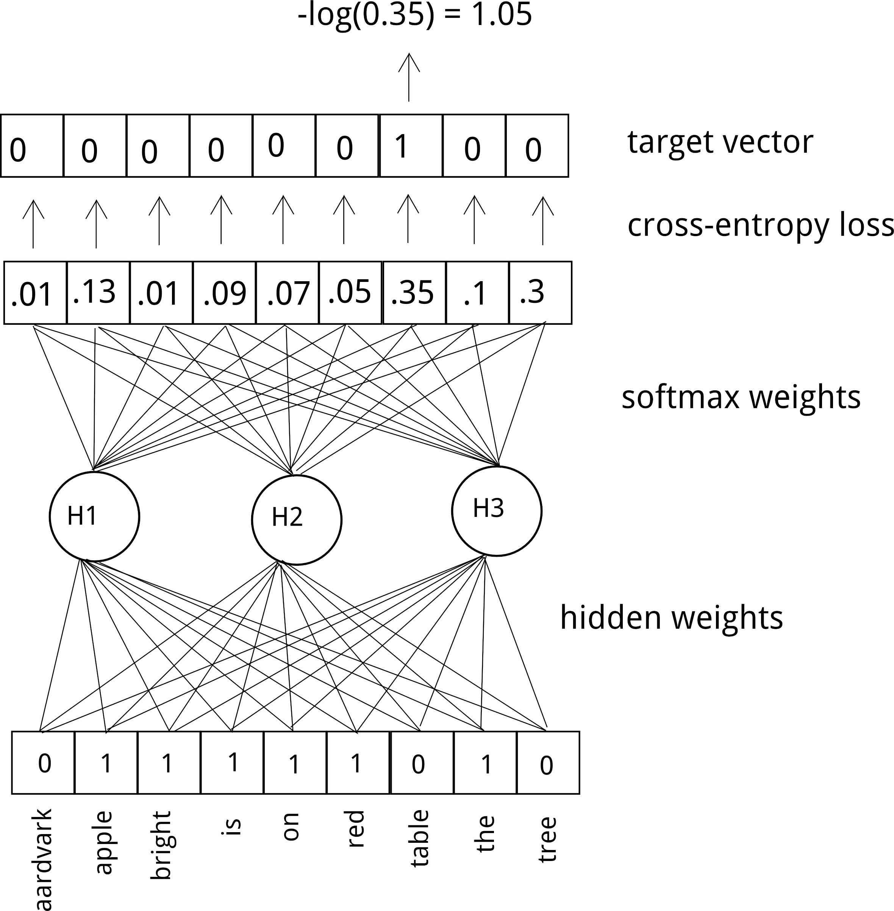

# Muinaiset kielet, sanasemantiikka ja laskennalliset menetelmät {.title}

# Tutkimuksen tekijät

* ANEE: Ancient Near East Empires, Suomen Akatemian huippuyksikkö 2018-2025
  * Muinainen (ensimmäinen vuosituhat eKr.) lähi-itä (Mesopotamia, "kaksoisvirran maa")
  * Digihumanismi, arkeologia, yhteiskuntatieteelliset teoriat
  * Tero Alstola, Saana Svärd, Aleksi Sahala, Eleanor Bennett ym.

# Tutkimuksen tekijät

* Minä (Sam Hardwick)

* _En_ assyriologi, vaan kieliteknologi

* Silloin HY:llä, nyt CSC:llä kehittämässä Kielipankkia

# Akkadin kieli

* Kuuluu kuolleeseen itäseemiläisten kielten perheeseen

* Käytössä n. 2500 eKr. - 500 eKr.

* Vaikutti vahvasti aramean kieleen, jolla lopulta korvautui

* Gilgamešin eepos

<!-- ::: {.container} -->
<!-- :::: {.col} -->
<!-- :::: -->
<!-- :::: {.col} -->
<!-- :::: -->
<!-- ::: -->

<!--  -->

<!-- *  -->

# Akkadin kieli

::: {.compress}

|akkadi|heprea|arabia|suomi|
|------|------|------|--------|
|bītum|báyit (בַּיִת)|bayt (بَيْت)|talo|
|šarrum|śar (שַׂר)|sarī (سَرِيّ)|kuningas / prinssi / viranomainen|
|ilum|ʾēl (אֵל)|ilāh (إلٰه) → Allāh (الله)|jumala|
|šulmu|šālōm (שָׁלוֹם)|salām (سلام)|rauha, hyvinvointi|
:::

# Nuolenpääkirjoitus

* Meille säilynyt versio kirjoitetusta akkadista on nuolenpääkirjoitus, savitauluihin painettuja kolmio- ja viivamuotoja

* Logosyllabinen järjestelmä: joitain sanoja vastaa logogrammi, ("kuva"), muut kirjoitetaan tavumerkeillä

* Lainaa sumerista, alueen aiemmasta valtakielestä, joka on isolaatti mutta säilyi seremoniallisessa käytössä itsenäisesti

# Nuolenpääkirjoitus

<figure>

<figcaption>Assurbanipalin sotaretki Egyptissä</figcaption>
</figure>

# Nuolenpääkirjoitus

* Savitauluja on säilynyt yllättävän suuri määrä, n. 500 000

* Niistä on translitteroitu, käännetty ja julkaistu vain pieni osa, n. 10%

# Mesopotamia

<figure>

<figcaption>Uus-Babylonian valtakunta n. 550 eKr.</figcaption>
</figure>

# Mesopotamia

* Sumerin kaupunkivaltiot 5500 - 1800 eKr (_Ur_)
* Akkadin valtakunta 2300 - 2100 eKr (_Sargon akkadilainen_)

# Mesopotamia
* Assyrian ja uus-Assyrian valtakunta 2000 - 600 eKr. (_Tukulti-Ninurta_, _Tiglath-Pileser_, _Ashurnipal_, _Nineven kirjasto_)
  * Tuttuja myös VT:stä! (2. Kuninkaiden kirja, Aikakirjat ym.)
* Uus-Babylonian valtakunta 626 – 539 eKr. (_Nebukadressar_)
  * VT: Jerusalemin valtaus, karkoitus Babyloniaan

# Haasteita

* Kieliaineisto kattaa pitkiä ajanjaksoja, sitä on paljon, ja sen tulkinta on vaikeaa (ja tulkintakykyisiä tutkijoita on vähän)

* Voisiko laskennallisilla menetelmillä paljastaa aineistosta kulttuurillisia ja sosiaalisia ilmiöitä?
  * Henkilönimien muodostamat sosiaaliset eliitit
  * Semanttiset ilmiöt

# Sanasemantiikka

* Jakaumahypoteesi (_distributional hypothesis_): sanoilla, joiden ympäristöt ovat samanlaisia, on samanlainen merkitys
  * _elokuva oli loistava_
  * _elokuva oli erinomainen_
  * _elokuva oli hirveä_
  * _otin omenan pöydältä_
  * _otin omenan puusta_

# Sanasemantiikka

|             |loistava   |erinomainen|elokuva|kolme |
|-------------|-----------|-----------|-------|------|
|loistava     |           |      3    |  57   |  4   |
|erinomainen  |     3     |           |  39   |  5   |
|elokuva      |     57    |      39   |       |  11  |
|kolme        |     4     |      5    |  11   |      |

#

# PMI

* Pointwise mutual information: miten paljon todennäköisempää on sanan A esiintyminen sanan B ympäristössä kuin yleensä?

* Tuottaa pareittaisia etäisyyksiä, ei vektoriavaruutta

# Sanaupotusten tulkinta

* Sanaupotuksia käytetään yleensä sovelluksissa, ei suoraan tulkintaan

* Sanaupotukset muodostavat yleensä n. 100-ulotteisen avaruuden

* PMI-parit muodostavat verkoston, jossa on N^N kaarta

# Demo: ulotteisuus

# Miten tehdä tulkittavampia upotuksia?

* PCA (principal component analysis), LDA (linear discriminant analysis), ...

* Ongelma: yleensä kieliopilliset ilmiöt dominoivat semantiikkaa

# Verkostojen asettelualgoritmit

* Joko upotusten läheisyydestä tai PMI-pareista voidaan tehdä "puoleensavetäviä voimia" ja mallintaa sanastoa 2D-verkkona

* "Fysiikkasimulaatio" päätyy tasapainotilaan

* Yifan Hu, Fruchterman-Reingold, ForceAtlas

* ForceAtlas2: Mathieu Jacomy et al. (2014)

# Asettelualgoritmit

# Demo: ANEE-portaalit

# Sovellukset

<figure>

<figcaption>Lindén et al.: Social group identities and semantic domains in the ancient Near East (2024)</figcaption>
</figure>

# Sovellukset

<figure>

<figcaption>Lindén et al.: Social group identities and semantic domains in the ancient Near East (2024)</figcaption>
</figure>

# Linkkejä

* <a href="https://etsin.fairdata.fi/datasets?search=akkadi&page=1">Akkadinkielinen data Etsin-palvelussa</a>
* <a href="https://www.helsinki.fi/en/researchgroups/ancient-near-eastern-empires/anee-lexical-networks-v20">Leksikaaliset portaalit ANEE:n sivuilla</a>

# Kuvakrediitit
::: {.compress}
Assurbanipalin sotaretki: kaappaus teoksesta Smith, George: _History of Assurbanipall, Translated from the Cuneiform Inscription_ (1871, <a href="https://archive.org/details/bub_gb_pFk53uejMjcC/page/n63/mode/2up">archive.org/details/bub_gb_pFk53uejMjcC/page/n63/mode/2up</a>)

Uus-Babylonian kartta: <a href="https://en.wikipedia.org/wiki/Neo-Babylonian_Empire#/media/File:Neo-Babylonian_Empire_under_Nabonidus_map.png">en.wikipedia.org/wiki/Neo-Babylonian_Empire#/media/File:Neo-Babylonian_Empire_under_Nabonidus_map.png</a>

Sargonin naamio: <a href="https://commons.wikimedia.org/wiki/File:Sargon_of_Akkad_(1936).jpg">commons.wikimedia.org/wiki/File:Sargon_of_Akkad_(1936).jpg</a>

Asettelualgorimit: <a href="https://journals.plos.org/plosone/article?id=10.1371/journal.pone.0098679">journals.plos.org/plosone/article?id=10.1371/journal.pone.0098679</a>
:::
<!--  -->
