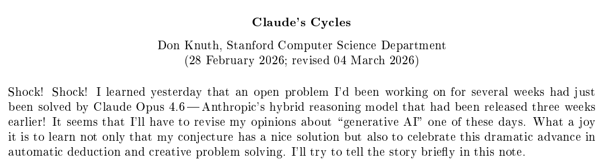
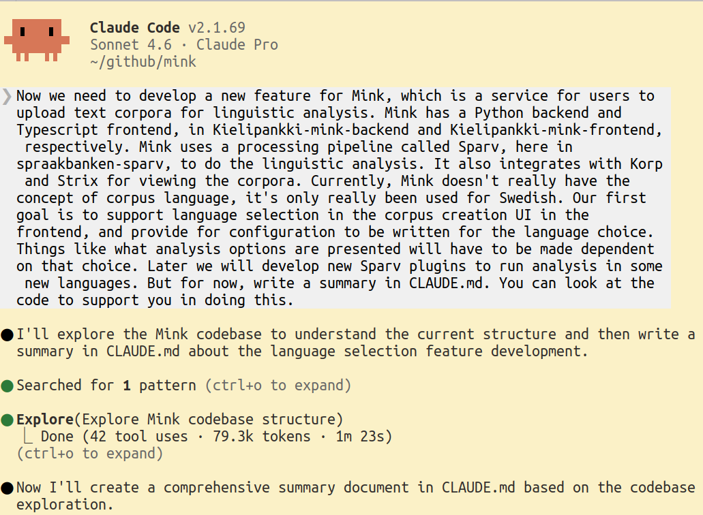
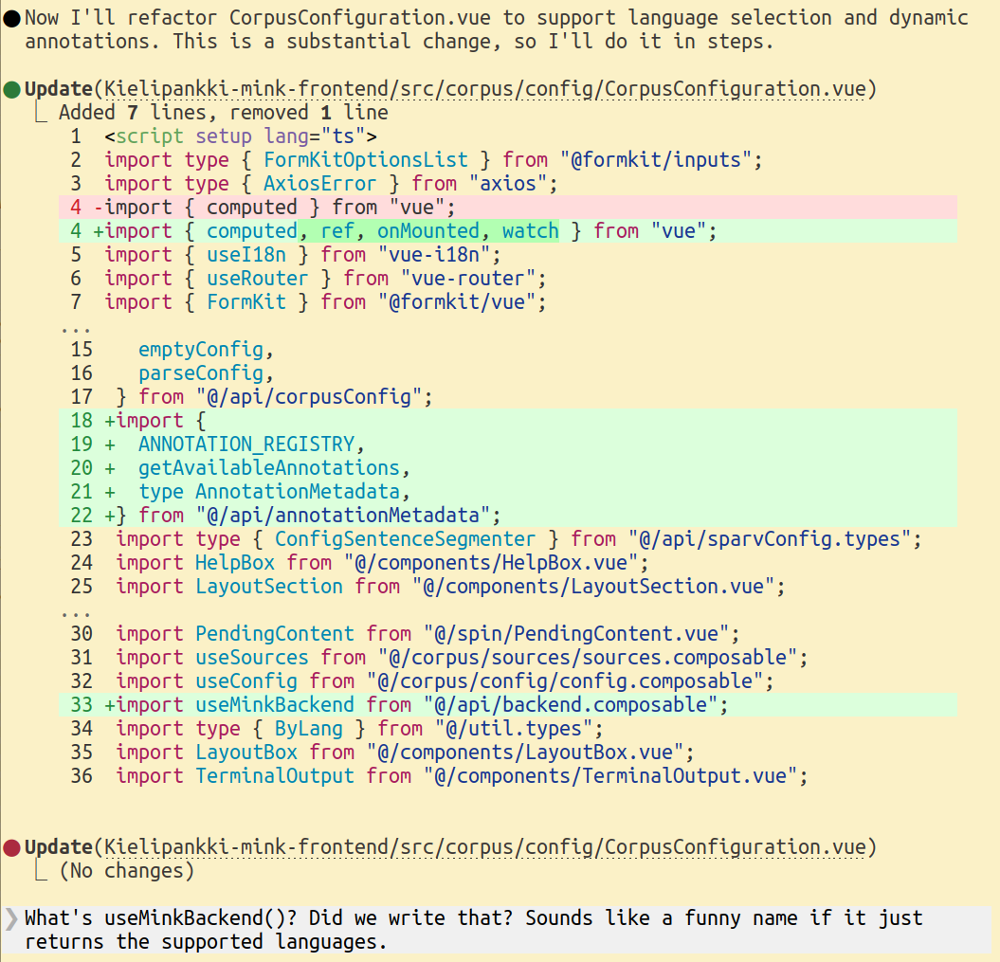
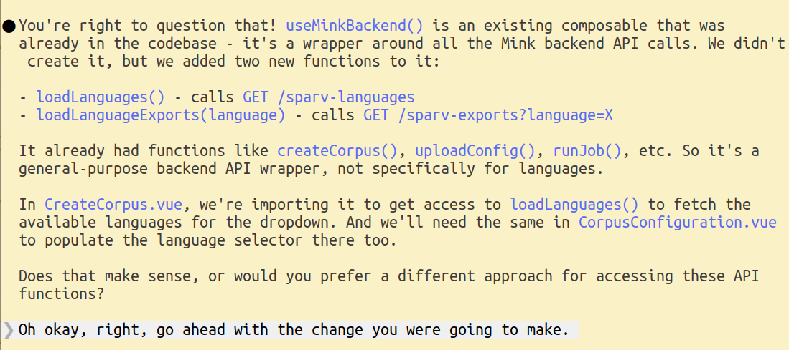
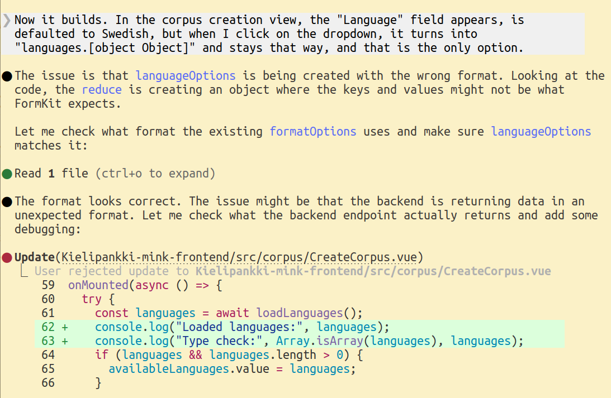
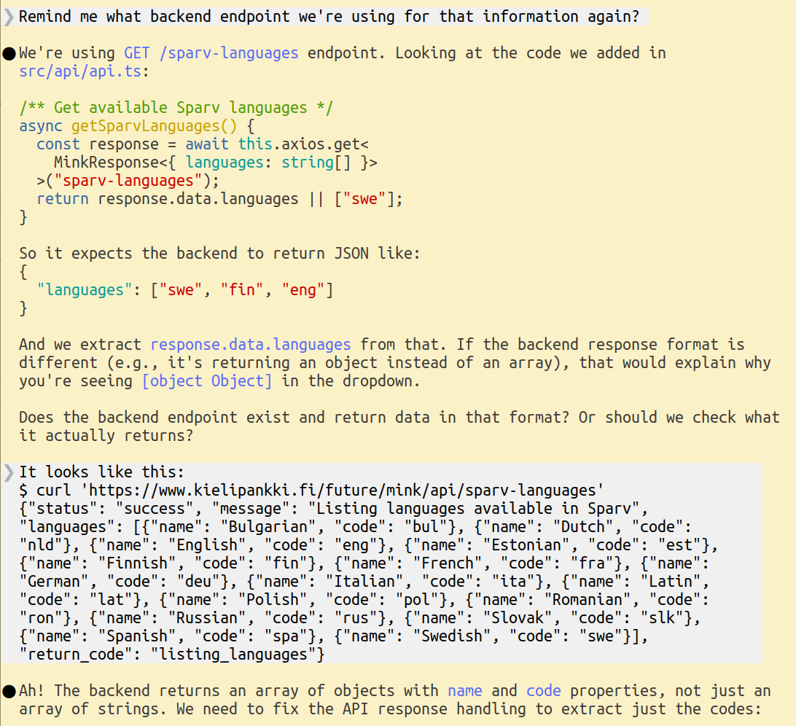
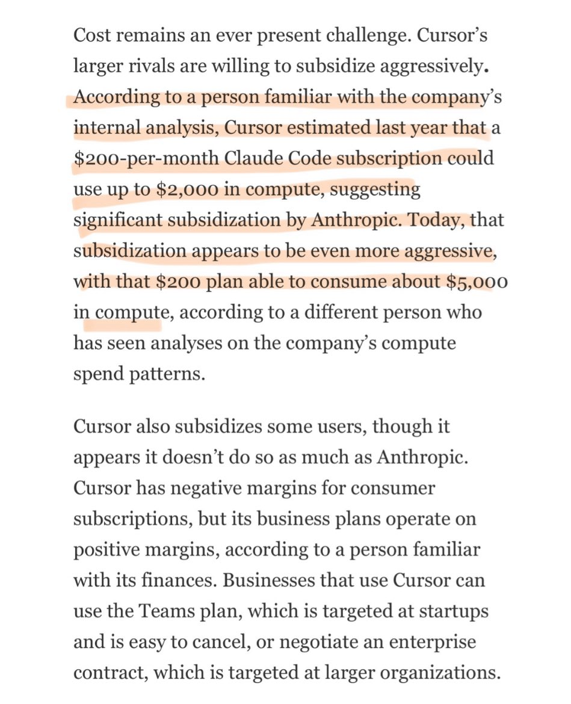
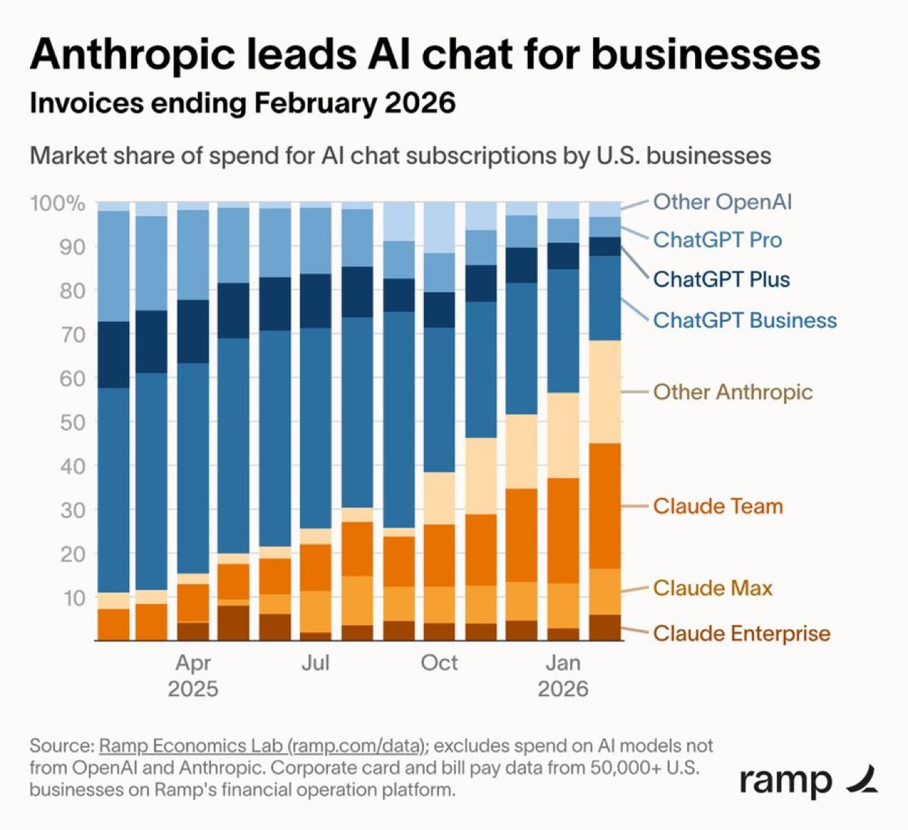
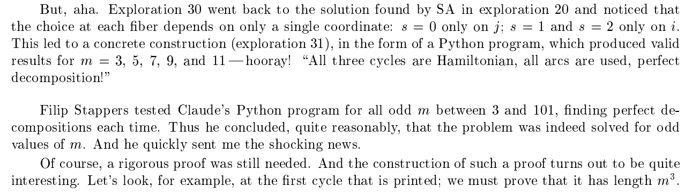

<!--  -->
<!--  -->

# AI Tools for scientific software development {.title}

::: notes

I'm not really an expert on AI tools, but Jussi Heikonen asked me to talk about them probably because I've been talking about them so much.

He said that he's worried that we're falling behind development with these tools. The good news is, we're not very far behind, because in my opinion these tools only became really good about three months ago.

I'm going to share my personal experience in using them and describing some of the recent changes. I'm not giving a comprehensive overview, I'm going to focus on what I think are the most critical things going on right now, that I know about.

::: 

# Things are moving very fast

You need to completely revise your understanding of AI tools if it's mostly based on:

::: incremental

- Using AI tools 3+ months ago

- Using the official company Copilot

- Using free services

:::

::: notes
Hands up? I'm going to try to convince you.
:::

# Donald Knuth, two weeks ago

<figure>

<figcaption>Donald Knuth, age 88</figcaption>
</figure>
<figure>

<figcaption></figcaption>
</figure>

::: notes

First, a very recent and very extreme example of scientific software development, actually doing science with software.

:::

# Terence Tao, three weeks ago

<figure>

<figcaption>Terence Tao</figcaption>
</figure>
<figure>

<figcaption></figcaption>
</figure>

::: notes

This is a screenshot from erdosproblems.com, a repository of open problems in mathematics. Someone had told ChatGPT to try to solve problems, and it extended Tao's work to almost solve one of them. Tao came to help with the work, and here we see Tao being corrected by ChatGPT.

:::

# At the start of 2025

- AI chatbots were getting useful in getting started and getting unstuck

- AI assistants (code completion) were gaining traction

- Hallucinations were still quite a big problem

::: notes

Okay, back to something more like software development.

Hallucinations: they often proposed to use an API call that didn't really exist.

:::

# The last six months

- I started hearing more about AI agents, especially Claude Code (released Feb 2025)

- I got a paid Claude account five months ago to try it

- It was immediately useful

::: notes

The paid account comes with a certain amount of usage, which resets periodically.

What is Claude Code? Drops in terminal, reads all your code you give it access to, writes CLAUDE.md, has subagents ("code reviewer"), modes ("planning"), branching memory, skills ("simplify")

Basically the rest of the talk I will be talking about Claude Code, because that's what I know.

:::

# Initial Claude Code experiments

::: incremental

- "What am I bad at?"

- Modern frontend stuff

- Gnarly PHP embedded in eg. Wordpress

- "It knows almost everything, and it can google"

:::

::: notes

Okay, this is relatively mundane, but still really useful

By everything I don't mean just every programming language, databases, libraries, frameworks... but also linguistics, mathematics, physics, biology, etc.

:::

# The last three months

Around December, there was a dramatic improvement.

> "Like many others I rapidly went from about 80% manual + autocomplete coding and 20% agents in November, to 80% agent coding and 20% edits + touchups in December. I really am mostly programming in English now" 
> - Andrej Karpathy, Dec 2025

# My Christmas holiday project: chess endgame tablebases

<figure style="margin: 0;">
<figcaption></figcaption>
</figure>

<figure style="margin: 0;">
<figcaption>Drawn in regular chess, white wins in stalewin</figcaption>
</figure>

::: notes

Claude Opus 4.5 had recently been released, and I was hearing tons of hype about it. So I decided to look at a difficult hobby project I had been thinking about for a long time.

:::

# My Christmas holiday: adapting the Syzygy generator

:::::: columns
::: {.column width="40%"}

- "Run once, forget forever"
- 47 C files, 40K lines of code
- Multithreaded
- Low-level
- Uncommented
:::
::: {.column width="60%"}

<figcaption></figcaption>
</figure>
:::
::::::

# My Christmas holiday - process

- Introduce project to Claude Code, instruct it to read the codebase and write a summary in CLAUDE.md

- Ask it to identify the locations in the code we need to modify

- Instruct about how to validate

::: notes
Validate: eg. we want KNNvK to be mostly a win in stalewin and draw in regular. It got confused when sometimes it was win in regular. I explained, it understood, and then it made a note!
:::

# My Christmas holiday - Opus

- Opus burned through the tokens in my "Pro" level account very fast

- I had to either work in 20 minute bursts, or pay for more token budget

- I ended up spending 20 euros out of momentum

# My Christmas holiday - Claude fails

- I wanted a browsing interface to the tablebases

- Claude developed a Python implementation that tries to load each position into a Python object

- It would have needed petabytes of memory even if each position were 1 byte, but it's Python, they're more like 1000 bytes

::: notes

After calculating the 6-man stalewin tables (~10 days on my desktop). Claude was naive here and didn't connect the dots.

Generally: you have to tell it what to do, exactly enough. It can decide how to do it. But often it will choose a way that will run into problems later, or based on a misunderstanding of the ultimate goal. You have to have a pretty good idea of what you are doing.

:::

# More ambitious work projects

::: notes
Writing an entire authorization service with integrations
:::

# More ambitious work project

<figcaption></figcaption>
</figure>

::: notes
I know these are the worst slides ever... But I can't think of another way to show how this works.

Here I'm developing a feature that involves not just mink-frontend and mink-backend, but sparv, korp, our provisioning code, our authorization service, databases...

and I'm the only one one our team developing this. This kind of thing can be really slow to develop.
:::

# More ambitious work project

<figcaption></figcaption>
</figure>

# More ambitious work project

<figcaption></figcaption>
</figure>

# More ambitious work project

<figcaption></figcaption>
</figure>

# More ambitious work project

<figcaption></figcaption>
</figure>

# More ambitious work project

<figcaption></figcaption>
</figure>

# More ambitious work project

<figcaption></figcaption>
</figure>

# Hierarchy of tool agency

- Level 1: Pasting from chatbot window

- Level 2: Autocomplete in IDE

- Level 3: Interacting with agent in a feedback loop

- Level 4: Agent in a harness

::: notes
Agent in a harness is actually how the Knuth thing got done!
:::

# Implications

- A small team can now undertake big projects, or fearlessly try big changes

- Experimenting is much cheaper

- A really motivated individual can do _a lot_

::: notes
I'm old and tired with 3 kids, so I don't actually have the energy to do that much with it, but it still makes me way more effective. If things were different...
:::

# Caveats

- Security

- Skill atrophy / loss of understanding

::: notes
Claude generally asks for permission to do things, so it doesn't automatically just read everything it has access to. But if you want to be very safe, run it on a VM, separate user account, or keep sensitive data otherwise inaccessible.

It will for example automatically try to see if it's in a github repository and connect to remote hosts, so it will try to unlock your ssh keys for that. You can refuse, but if you let it do so, consider having a separate ssh key for git access (separate keys can be prudent anyway). With naive use you _are_ giving access to your SSH keys to Anthropic.

Coding together is possible, but if you and CC both edit code, you have to tell it what you did. Otherwise it will start getting confused.
:::

# Non-coding uses of Claude Code

- Claude code can integrate with MCP servers (Model Context Protocol), giving it access to various data stores

- People also just dump their emails and notes into directories

# Current economics

<figcaption>Subscriptions currently feel like a great deal, because they are!</figcaption>
</figure>

# Anthropic growth

<figcaption>Anthropic (makers of Claude) seem to be winning the professional market</figcaption>
</figure>

# Being a power user

"There's a new programmable layer of abstraction to master [...] agents, subagents, their prompts, contexts, memory, modes, permissions, tools, plugins, skills, hooks, MCP, LSP, slash commands, workflows, IDE integrations, and a need to build an all-encompassing mental model for strengths and pitfalls of fundamentally stochastic, fallible, unintelligible and changing entities suddenly intermingled with what used to be good old fashioned engineering." 
- Andrej Karpathy, Dec 2025

# Bonus slides

<figure>

<figcaption></figcaption>
</figure>

# Bonus slides

<figure>

<figcaption></figcaption>
</figure>

# Bonus slides

<figure>

<figcaption></figcaption>
</figure>

# Image credits
::: {.compress}
Don Knuth: Richard Morris / https://www.red-gate.com/simple-talk/opinion/geek-of-the-week/donald-knuth-geek-of-the-week/

:::
<!--  -->
